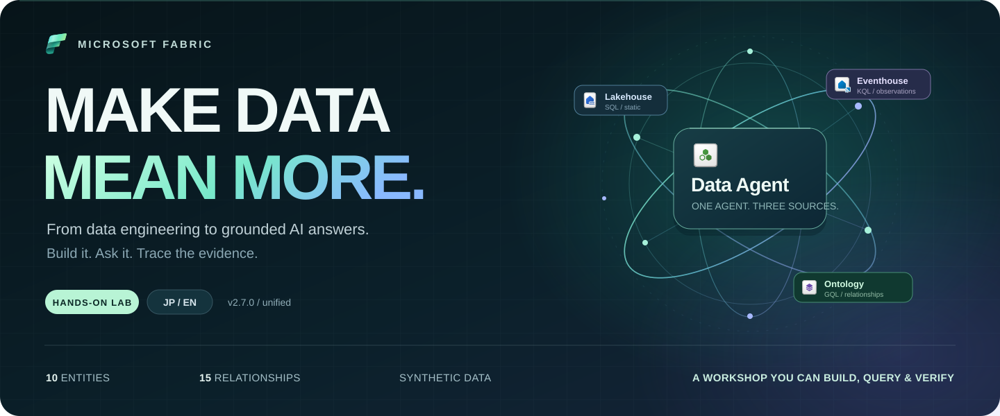
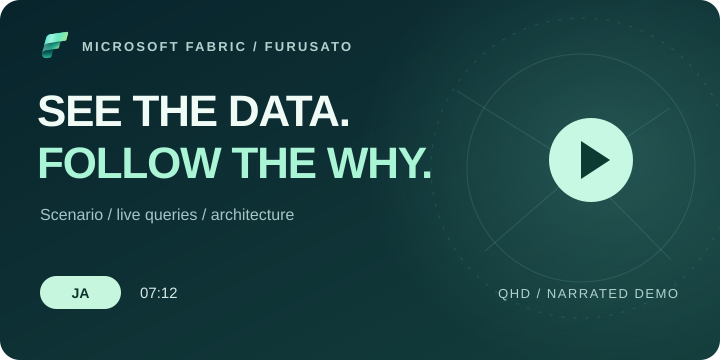
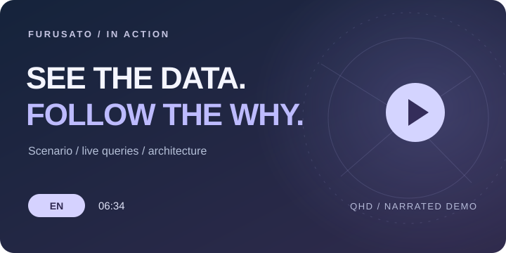

<a id="top"></a>

<div align="center">

<p><strong>MICROSOFT FABRIC · HANDS-ON WORKSHOP</strong></p>
<h1>Furusato × Fabric IQ</h1>
<p><strong>データに意味を。問いに、根拠を。</strong></p>
<p>ふるさと納税の合成データで学ぶ、Ontology・Data Agent・OneLake。</p>

[日本語](#日本語) &nbsp; / &nbsp; [English](#english)

</div>



<div align="center">

**[ガイドを読む ↗](#最新版を使う)** &nbsp; · &nbsp; **[実画面のデモを見る ↗](#workshop-videos-ja)** &nbsp; · &nbsp; **[デプロイする ↗](#ツール別のデプロイ手順)**

`v2.7.0` &nbsp; `unified-20260914` &nbsp; `SQL · KQL · GQL` &nbsp; `JP / EN` &nbsp; `Synthetic data`

</div>

**データを準備し、業務の関係をモデル化し、AIの回答を実行結果までたどる。**
DBA・BIエンジニアを中心に、リレーショナルモデルから業務の意味・同一性・関係経路を設計する考え方を、
Microsoft Fabricのハンズオンで学びます。

---

## 日本語

<sub>START HERE / 学び方を選ぶ</sub>

| **01 &nbsp; READ** | **02 &nbsp; WATCH** | **03 &nbsp; BUILD** |
| :--- | :--- | :--- |
| **まずは、教材から。**<br>全19章・5付録。Wordと自己完結の日英HTMLで、手元から学習を始めます。<br><br>[最新版ガイド →](#最新版を使う) | **実際の操作を見る。**<br>口語の質問からSQL・KQL・GQLの結果まで。日本語・英語のQHDデモを用意しています。<br><br>[紹介動画 →](#workshop-videos-ja) | **自分の環境で構築する。**<br>6クライアントの入口から、共通のpreview・承認・実行・評価へ進みます。<br><br>[デプロイ手順 →](#ツール別のデプロイ手順) |

**このページのナビゲーション**<br>
[学べること](#learning-outcomes-ja) · [アーキテクチャ](#workshop-architecture-ja) · [実習の構成](#実習の構成) · [Ontology / RDF](#ontology-schema-ja) · [依頼プロンプト](#デプロイ依頼プロンプト) · [リポジトリ構成](#リポジトリ構成) · [時間・費用](#reference-run-ja) · [前提と安全](#前提と安全上の境界) · [配布物の検証](#deployment-integrity-checks)

<a id="learning-outcomes-ja"></a>

### このWorkshopで、何をつなぐか

| **データをつくる** | **意味をつなぐ** |
| :--- | :--- |
| **OneLake · Lakehouse · Eventhouse**<br>静的スナップショットと運用観測を分け、CSVの準備からイベントを起点とする取り込みまでを学びます。 | **Ontology · SQL · KQL · GQL**<br>Entity・キー・プロパティ・関係を設計し、業務の言葉を実データの照会へつなぎます。 |
| **根拠を確かめる**<br>**Data Agent · Code Interpreter**<br>自然な質問への回答を、使ったソース・実行したquery・返却値・実際の分析成果物まで確認します。 | **分析を届ける**<br>**Notebook 05 · Direct Lake · Power BI**<br>Optionalの分析枝では、品質処理と可視化を体験し、AI用の根拠とBI用の集計の役割を整理します。 |

> **1つの主Agent、3つのソース。** Code Interpreterは同じAgentの追加ツールです。<br>
> 読むだけでなく、構築・照会・検証までを一つの流れとして体験します。

<a id="workshop-architecture-ja"></a>

<sub>THE SYSTEM / 全体を見渡す</sub>

### 全体アーキテクチャ — 業務の問いから技術のつながりへ


寄付の全体像、新しく届く観測、返礼品に登録された事業者を、**1 件の Data Agent と 3 つのソース**で調べます。
図では、静的データの準備、FileCreated を起点とする運用取り込み、Ontology の意味づけと照会、
Notebook 05 の品質処理から Direct Lake / Power BI へ向かう分析経路を分けて示しています。

[日本語の解説](docs/architecture/overview.ja.md) · [English explanation](docs/architecture/overview.en.md) ·
[対話型の構成図](docs/architecture/index.html?lang=ja&focus=overview) ·
[原寸 PNG](docs/assets/architecture/furusato-architecture.ja.png) · [SVG](docs/assets/architecture/furusato-architecture.ja.svg)

対話型 HTML はリポジトリを取得してローカルで開くと、各経路と学習成果を切り替えて確認できます。
アイコンは指定の [AzureDiagarm コレクション](https://github.com/yang-jiayi/AzureDiagarm/tree/main/Azure_Public_Service_Icons/Icons)から取得し、
[出典・利用条件](docs/architecture/icons.md)と[実装の根拠](docs/architecture/sources.md)を記載しています。

<a id="workshop-videos-ja"></a>

<sub>WATCH IT WORK / 画面からつかむ</sub>

### 紹介動画 — 実画面で見る Workshop

**第3版：業務シナリオ → 口語の質問3例 → 技術解説 → 全体アーキテクチャと学習成果。**
「最初の寄付データは全部で何件？」「8月分は何件、いくら？」「この返礼品には、どの事業者が登録されている？」
という自然な質問を実画面で試し、実際の照会と結果をたどります。
Ontology のキー・型・説明・バインディング・関係の向きを確認し、最後に Fabric のアイコン入り構成図で
データの流れと学べることを整理します。固定画角とハイライトを中心に、説明と画面のテンポを整えました。

| 日本語 | English |
| :--- | :--- |
| [](https://github.com/yang-jiayi/furusato-fabric-workshop/releases/download/v2.7.0-workshop-videos-v3-20260921/Furusato_Fabric_Workshop_JA_QHD.mp4)<br>**[日本語版を再生・ダウンロード ↗](https://github.com/yang-jiayi/furusato-fabric-workshop/releases/download/v2.7.0-workshop-videos-v3-20260921/Furusato_Fabric_Workshop_JA_QHD.mp4)**<br>約7分12秒 · 日本語ナレーション | [](https://github.com/yang-jiayi/furusato-fabric-workshop/releases/download/v2.7.0-workshop-videos-v3-20260921/Furusato_Fabric_Workshop_EN_QHD.mp4)<br>**[Watch or download in English ↗](https://github.com/yang-jiayi/furusato-fabric-workshop/releases/download/v2.7.0-workshop-videos-v3-20260921/Furusato_Fabric_Workshop_EN_QHD.mp4)**<br>About 6:34 · English narration |

`QHD 2560 × 1440` · `30 fps` · `字幕なし` · `男性AI音声 / 1.1倍速`

[動画の Release と SHA-256](https://github.com/yang-jiayi/furusato-fabric-workshop/releases/tag/v2.7.0-workshop-videos-v3-20260921)
からも取得できます。大容量の MP4 は Git の履歴には含めず、GitHub Releases で配信します。
動画にはリポジトリと同じアクセス権が適用されます。

> [!NOTE]
> 合成データを使った既存環境での読み取り専用の実演です。設定とデータを保持し、
> アカウント表示・実環境 URL・接続先・実行時識別情報を配布用コピーで伏せています。
> リポジトリと構成図は実ファイルのローカル閲覧画面です。実行待ちと画面操作の一部を短く編集しています。
> 各質問では実際に選ばれた SQL／KQL／GQL の経路を示し、Graph エディターの手動演習は別の確認として扱います。
> 英語版では、回答の表示言語を整える追質問も紹介します。
> 個別の照会例を手がかりに、下記の最新版ガイドで構築・検証・学習を進めてください。

<sub>YOUR STARTING POINT / 手元に教材を</sub>

### 最新版を使う

配布版は `v2.7.0 / unified-20260914` です。
Word と HTML を同じフォルダーへ保存すると、HTML 内の Word ダウンロードリンクも利用できます。

| ファイル | 内容 |
|---|---|
| [参加者ガイド — Word](docs/Fabric_IQ_Ontology_Workshop_Furusato_Participant_v2.7.0_unified-20260914.docx) | 全 19 章・5 付録、元の 10 問・84 条件、同じ Agent の CI 演習、Notebook パラメーター |
| [対応する日英 HTML](docs/furusato-workshop-v2-7-0-complete_unified-20260914.html) | 同じ教材。日英切替・検索・実習チェック・印刷に対応する自己完結 HTML |

配布ファイルは [RELEASE_SHA256SUMS.txt](RELEASE_SHA256SUMS.txt) で照合できます。
文書を配布するときは、上の Word 1 本・HTML 1 本を同じフォルダーに置きます。
内部の評価記録・調査資料・作業ログは受講者向け配布物には含めません。

この公開版は最新版の配布物だけから始める独立した履歴です。旧 Private 履歴を取り込まず、
同じ URL から**新しく clone**してください。新しい GitHub repository ID に Secrets・Environments・
認証や Fabric の権限は引き継がれません。
[公開版のデプロイ・標準10問／84条件・非公開の追加評価の始め方](docs/public-onboarding/README.md)を参照してください。

> [!TIP]
> 初めての方は、**[公開版オンボーディング](docs/public-onboarding/README.md) → 上の参加者ガイド → [共通のデプロイ手順](#ツール別のデプロイ手順)**の順がおすすめです。
> 配置をAIエージェントへ依頼する場合は、[コピペ用プロンプト](#デプロイ依頼プロンプト)から始められます。

> [!IMPORTANT]
> HTML はオフラインで読めますが、実習の実行には `workshop/v2.7.0` のデータ・Notebook・設定ファイルが必要です。
> 手順と設定の提供は、すべての環境での実行成功や AI の全問正答を保証するものではありません。
> このコースは **主 Data Agent 1 件・3 ソース・Code Interpreter 1 ツール**で実施します。
> [構成と回答を確認するポイント](docs/single-agent-workshop.md)を参照してください。

### 実習の構成

| コース | 内容 |
|---|---|
| 最新コース（統合） | 主 Data Agent 1 件、Lakehouse SQL・Eventhouse KQL の参照ヘルパー、完全な教材用 Ontology、Code Interpreter |
| Optional | 一括構築用 Notebook 03／04、分析拡張用 Notebook 05、Power BI、UDF |

手動構築は Notebook **01 と 02** を使います。教材用 Ontology は
**10 Entity・72 static Property・1 time-series Property・15 Relationship** です。
統合構成はこの完全モデルを使い、AIPath を作成・接続しません。
Notebook 04 の一括構築では、最終 preview 前に `ENABLE_UNIFIED_DATA_AGENT=True`、
`ENABLE_AI_REFERENCE_ARCHITECTURE=False` を明示します。両方 True は禁止です。
配布 Notebook の既定値は False のため、コース用の設定を明示してください。
既存 Agent が異なる設定なら自動上書きせず、バックアップ・Draft 検証・Publish の段階的移行を使います。

1. Lakehouse に静的 CSV 8 本をアップロードし、Notebook 01 で 11 個の `ot_*` テーブルを作成する。
2. Ontology のエンティティ、キー、静的バインディング、15 関係を構成・照合する。
3. Eventhouse と Pipeline、OneLake FileCreated トリガーを構成する。
4. 増分 CSV 3 本を順次アップロードし、各ジョブの成功と件数を確認する。
5. 時系列バインディングを設定し、Notebook 02 でセマンティックメタデータを登録する。
6. 同じ SQL endpoint／KQL Database に参照ヘルパーを準備し、主 Data Agent の 3 ソース・統合指示・SQL/KQL 例・CI を設定する。元の 10 問と別枠の CI 演習を新しい会話で評価する。
7. 結果を確認してから Publish・スモークテスト・最小権限での共有を行う。

<a id="ontology-schema-ja"></a>

### Ontology の RDF / OWL 構成ファイル

完全な教材用 Ontology の**構造のみ**を、相互運用用の形式でも提供します。
10 クラス・72 静的属性・1 時系列属性・15 関係を保持し、寄付者や寄付の個票データは含めません。

| ファイル | 形式 |
|---|---|
| [furusato-ontology.ttl](workshop/v2.7.0/ontology/rdf/furusato-ontology.ttl) | Turtle で記述した RDF / OWL |
| [furusato-ontology.rdf](workshop/v2.7.0/ontology/rdf/furusato-ontology.rdf) | RDF/XML |
| [furusato-ontology.owl](workshop/v2.7.0/ontology/rdf/furusato-ontology.owl) | 同じ OWL 構成の RDF/XML（`.rdf` と同じ内容） |

3 本は同じグラフです。[構成ファイル用 SHA-256](workshop/v2.7.0/ontology/rdf/SHA256SUMS.txt) で照合できます。
11 バインド・15 contextualization、キー、業務上の意味、時系列の列対応は注釈として保持します。
実際の Workspace / Item ID は埋め込まず、配布テンプレートの変数を残します。
これは **Fabric へ直接インポートする定義ではなく**、接続・時系列処理・カーディナリティ制約を
OWL エンジンで実行するものでもありません。[変換規則と再生成方法](tools/ontology/README.md)を参照してください。
Word / HTML の教材内容や、稼働中の Ontology / Agent の構成は変更しません。

<sub>BUILD YOUR LAB / 同じ教材、選べる入口</sub>

### ツール別のデプロイ手順

**確認日：2026-09-18。** 以下は同じ配布 Notebook を使う入口です。
ツールごとに別のモデルや Notebook を生成させません。
公式資料・配布コード・利用可能な CLI のヘルプを照合していますが、
**6製品すべての実機デプロイを検証したものではありません**。
共通経路には Copilot app のツール設定済み環境での実施記録があります。
その記録では FileCreated による自動取り込みは成立せず、停止・確認・別承認後に手動取り込みを行いました。
他のクライアントへログイン状態や実行実績が引き継がれるわけではありません。

| クライアント | この手順で使う実行経路 | 確認範囲 |
|---|---|---|
| GitHub Copilot Desktop / Copilot app | ローカル Project と承認付き操作、または参加者によるポータル操作 | 公式資料＋共通経路の既往実行。追加ツールなしでの再現は未検証 |
| GitHub Copilot CLI | ローカル checkout で計画し、承認したコマンドを実行 | 公式資料＋`1.0.84-5` の `--help`。認証・承認操作・全工程の実行は未検証 |
| Claude Code | ローカル checkout で計画し、手動承認で進める | 公式資料＋`2.1.220` の `--help`。認証・承認操作・全工程の実行は未検証 |
| OpenAI Codex | Codex CLI の read-only で計画し、許可した操作だけ実行 | 公式資料・公開 CLI ソース。今回の端末では未実行 |
| Scout | Microsoft Scout (Frontier) の場合のローカル支援。別製品には適用しない | 公式資料。製品の選別が必要で、この Workshop の実行は未検証 |
| Microsoft 365 Copilot Cowork | 手順整理を依頼し、Fabric ポータル／認証済み端末で実行 | 公式資料。この Workshop の直接デプロイは未検証 |

必要な項目を開いてください。**共通の準備・実行経路 → 利用するツール**の順で確認します。

<details>
<summary><strong>共通の準備・Fabric 実行経路</strong> — 認証、Notebook 04、preview / apply</summary>

#### 共通の準備

組織が利用を許可したクライアントだけを使います。この公開リポジトリの閲覧に Private リポジトリの権限は不要です。
**GitHub のリポジトリ認証・AI クライアントへのログイン・Fabric の認証は別です。**
公開ファイルを取得できても Fabric の実行権限は付与されません。認証情報の貼り付けでアクセス問題を解決しないでください。
ローカル実行には Git、GitHub CLI、Python 3、PowerShell 7 を用意します。
以下のコマンド例は **PowerShell 7** 用です。既存の作業フォルダーではなく、新しい clone に対して実行します。

[GitHub CLI](https://cli.github.com/manual/gh_repo_clone) に必要なら `gh auth login` でログインし、
次の操作で取得したコミットを固定します。失敗時はその場で停止します。

```powershell
$ErrorActionPreference = 'Stop'
gh repo clone yang-jiayi/furusato-fabric-workshop furusato-workshop-run -- --branch main --single-branch
if ($LASTEXITCODE -ne 0) { throw 'Clone failed' }
Set-Location .\furusato-workshop-run
$Commit = git rev-parse --verify HEAD
if ($LASTEXITCODE -ne 0) { throw 'Commit lookup failed' }
git switch --detach $Commit
if ($LASTEXITCODE -ne 0) { throw 'Commit pin failed' }
$Commit
```

AI クライアントで開いた実際の checkout／worktree も、この SHA と一致させます。
実行中に `main` を取り直しません。[配布物の検証](#deployment-integrity-checks)を先に行い、
対象 Workspace 名・URL、空 Folder の URL、未使用 PID、非公開の証跡保存先を準備します。
稼働中の capacity、必要な権限、Ontology／Data Agent の提供条件を確認してください。
統合 SQL ヘルパーには **Fabric Notebook の driver host** に `pyodbc` と ODBC Driver 18 が必要です。
PC 側だけのインストールでは不足します（[前提の正本](tools/provisioning/reference_sql.py)）。

REST 操作や Power BI 配置を行う場合は、コマンドを動かす環境で
[Azure CLI に対象テナントでサインイン](https://learn.microsoft.com/en-us/cli/azure/authenticate-azure-cli-interactively)します。
`az login --tenant '<tenant-guid>'` を使用し、サブスクリプションを持たない利用者は
必要に応じて `--allow-no-subscriptions` を付けます。Fabric の権限を付与するコマンドではありません。
Windows、WSL、sandbox、クラウドセッション間で認証が共有されると仮定しないでください。
利用できない場合は参加者の認証済み端末で実行し、token のコピーや保護の一括解除は行いません。
この経路に**追加の Fabric MCP サーバーは必須ではありません**。MCP を使う場合は別途その認証・権限・対応操作を確認します。

#### 共通の Fabric 実行経路

各クライアントには、後掲の[デプロイ依頼プロンプト](#デプロイ依頼プロンプト)を渡します。
最初は計画と前提確認だけを依頼し、import や Spark 起動も含む有償・書き込み操作の前に承認します。
クライアントに実行能力がない場合も、次の経路を参加者が行えます。

1. [配布 Notebook 04](workshop/v2.7.0/notebooks/Notebook_04_Furusato_Provision_Complete_Workshop.ipynb)を
   Fabric の Workspace から[インポート](https://learn.microsoft.com/en-us/fabric/data-engineering/how-to-use-notebook#import-existing-notebooks)します。
   名前に `_<PID>` を付け、**新しく import したその Notebook だけ**を対象 Folder に配置します。
   root に作成された場合は、実行前に[移動](https://learn.microsoft.com/en-us/fabric/fundamentals/workspaces-folders#move-items-into-a-folder)してください。
   Notebook 04 は自分自身の配置 Folder を API で解決します。数値 `subfolderId` を GUID として渡しません。
2. Fabric 上の parameter cell を次のように設定します。`<PID>` と `<workspace-name>` は実値に置き換えます。
   埋め込み payload や runtime のセルを書き換えたり、ローカル Python でこの Notebook を実行したりしません。

```python
PARTICIPANT_ID = "<PID>"
EXPECTED_WORKSPACE_NAME = "<workspace-name>"
USE_PARTICIPANT_NOTEBOOK_NAMES = True
ENABLE_UNIFIED_DATA_AGENT = True
ENABLE_AI_REFERENCE_ARCHITECTURE = False
EXECUTE_NOTEBOOK_01 = True
CREATE_PIPELINE = True
REFRESH_GRAPH = True
CREATE_DATA_AGENT = True
CREATE_REFLEX = True
APPLY_CHANGES = False
CONFIRMED_PLAN_SHA256 = ""
EXCLUSIVE_CREATE_WINDOW_CONFIRMED = False
ALLOW_AUTOMATED_APPLY = False
```

3. 上から全セルを一度実行し、preview の配置先・8件の構築対象・競合・`PLAN_SHA256` を確認します。
   preview は構築処理を書き込みませんが、Notebook の import と Spark 起動が無料になるわけではありません。
   承認後、`CONFIRMED_PLAN_SHA256` にその値を設定し、`APPLY_CHANGES=True`、
   `EXCLUSIVE_CREATE_WINDOW_CONFIRMED=True` にして適用します。ほかの設定を変えた場合は preview を取り直します。
4. Notebook 04 の完了だけで全演習を完了扱いにしません。後掲プロンプトの工程 4～8 に従い、
   FileCreated の有効化、3増分の個別検証、トリガー停止、Notebook 05、Power BI 配置、Agent 評価まで進めます。
   自動取り込みが届かない場合の手動 Pipeline 起動は別承認です。
   Graph の復旧だけを目的に、成功した Notebook 01 や増分取り込みを再実行しません。

Notebook 04 の**構築対象8件**は Lakehouse、Eventhouse、KQL Database、Notebook 01、
Pipeline、Ontology、主 Data Agent、Activator です。import する Notebook 04、
補助 Notebook 02／03／05、KQL Queryset、Variable Library、UDF、Power BI のモデル／レポート、
サービスが生成する Graph／SQL endpoint 等は別に数えます。
既往の全教材配置は21件でしたが、8件と同義でも、すべての環境の固定物理件数でもありません。
実 ID と種類を列挙して確認します。Notebook 02／03 は補助教材として配置しても重複適用しません。

API で操作できるクライアントは、[Items／Notebook API と Jobs API](https://learn.microsoft.com/en-us/fabric/data-engineering/notebook-public-api)で
同じ手順を実行できます。その場合だけ、**preview 前から** `ALLOW_AUTOMATED_APPLY=True` と正確な Workspace 名を設定します。
[Jobs API](https://learn.microsoft.com/en-us/rest/api/fabric/core/job-scheduler/run-on-demand-item-job)の
受理応答は完了ではありません。既存の実行を確認し、返された job ID／Location と `Retry-After` を使って最終状態まで監視します。
各ツール固有の万能な `fabric deploy` コマンドが存在するという意味ではありません。

</details>

<details>
<summary><strong>GitHub Copilot Desktop / Copilot app</strong> — ローカル Project</summary>

#### GitHub Copilot Desktop / Copilot app

ここでいう Desktop は **GitHub Copilot app** であり、Git 操作用の GitHub Desktop とは別製品です。
[公式アプリ](https://github.com/features/ai/github-app)を導入し、**Sign in to GitHub** でログインします。
[公式 quickstart](https://docs.github.com/en/copilot/get-started/quickstart-copilot-app)に従い、
**Projects → + → Add project from → Local folder or repository** で上記 checkout を開きます。
クラウドではなくローカル実行を選び、SHA と作業先を確認します。
**Plan** で共通プロンプトの計画を確認し、承認した工程だけを **Interactive** で進めます。
この手順では Autopilot を選びません。必要なら `/terminal` から認証済みの実行環境を確認します。
利用可能な機能・組織ポリシーは[セッションの公式説明](https://docs.github.com/en/copilot/how-tos/github-copilot-app/agent-sessions)も確認してください。

</details>

<details>
<summary><strong>GitHub Copilot CLI</strong> — ターミナルから計画・承認</summary>

#### GitHub Copilot CLI

[現行 CLI の導入手順](https://docs.github.com/en/copilot/how-tos/copilot-cli/set-up-copilot-cli/install-copilot-cli)で
`copilot` を導入します。旧 `gh copilot` 拡張ではありません。checkout のルートで開始します。

```powershell
copilot login
copilot --plan
```

フォルダーの trust とログインを確認し、共通プロンプトを渡します。
承認後は対話実行へ切り替え、必要な操作を1回ずつ承認します。
既存の許可設定で確認が省略される場合があるため、[tool permissions](https://docs.github.com/en/copilot/how-tos/copilot-cli/use-copilot-cli/allowing-tools)を確認します。
Plan と自動実行の併用や、全ツール・全パスの一括許可は行いません。

</details>

<details>
<summary><strong>Claude Code</strong> — Plan から手動承認へ</summary>

#### Claude Code

[公式 setup](https://code.claude.com/docs/en/setup)に従って導入し、ローカル checkout のルートで起動します。

```powershell
claude --permission-mode plan
```

初回のブラウザー認証を完了し、共通プロンプトを渡します。
計画を確認したら **手動承認**を選び、各工程の承認を保ちます。
モード名は版によって異なるため `claude --help` と[公式 permission modes](https://code.claude.com/docs/en/permission-modes)を照合してください。
Plan は OS レベルの完全な読み取り専用 sandbox ではなく、shell 実行を伴う場合があります。
Auto・編集の自動許可・権限確認の迂回を使わず、制限される操作は参加者の端末／Fabric ポータルで行います。

</details>

<details>
<summary><strong>OpenAI Codex</strong> — read-only で始める</summary>

#### OpenAI Codex

「CodeX」はここでは **OpenAI Codex CLI** として記載します。
[公式導入手順](https://github.com/openai/codex#installing-and-running-codex-cli)と
[Windows／WSL の注意点](https://developers.openai.com/codex/windows)を確認し、checkout のルートで起動します。

```powershell
codex login
codex --sandbox read-only --ask-for-approval on-request
```

認証後に共通プロンプトを渡し、read-only のまま配置計画を確認します。
`on-request` は全コマンドの逐次承認を意味しません。
この手順では、承認した書き込みを参加者の認証済み端末／Fabric ポータルで実行するか、
正確にレビューした要求だけを個別に許可します。
`workspace-write` は作業フォルダーの自動編集を許すため、手動承認と同一視しません
（[公式の sandbox／承認仕様](https://developers.openai.com/codex/agent-approvals-security)）。

</details>

<details>
<summary><strong>Scout</strong> — Microsoft Scout (Frontier) の場合</summary>

#### Scout

名称が一意ではないため、**以下は [Microsoft Scout (Frontier)](https://learn.microsoft.com/en-us/microsoft-scout/overview)
を利用する場合に限ります**。[ScoutOS の Scout](https://docs.scoutos.com/introduction)や
別製品を指す場合は適用せず、提供元・公式 URL を特定してください。Copilot app の別名とも扱いません。

1. [公式の導入条件](https://learn.microsoft.com/en-us/microsoft-scout/get-started)で OS、
   組織アカウント・ライセンス・管理者設定を確認し、案内された方法で導入・サインインします。Frontier はプレビューです。
2. 固定したローカル checkout を作業領域として許可し、共通プロンプトを**まず計画作成だけ**として渡します。
   [ファイル／shell 操作](https://learn.microsoft.com/en-us/microsoft-scout/use-microsoft-scout)はローカルで実行できますが、
   GitHub への書き込み権限、Azure CLI の導入・認証、Fabric の権限まで付与されるわけではありません。
3. shell の許可設定を確認し、実行するコマンド・宛先・影響を個別にレビューします。
   自動許可設定があるため「必ず毎回確認される」とは仮定しません。MCP の拡張機能も自動デプロイの検証実績ではありません。
   この Workshop での Scout による全工程実行は未検証のため、確実に承認を管理できない操作は、
   参加者が上記の共通 Fabric 経路／認証済み端末で実行します。手動操作を Scout の実行実績にしません。

</details>

<details>
<summary><strong>Microsoft 365 Copilot Cowork</strong> — 手順作成支援と参加者による実行</summary>

#### Microsoft 365 Copilot Cowork

Microsoft 365 の Cowork と、Anthropic の Claude Cowork は別に扱います。
[公式の利用条件](https://learn.microsoft.com/en-us/microsoft-365/copilot/cowork/get-started)に従い、
Microsoft 365 Copilot ライセンス、組織での有効化、Cowork の従量課金設定を確認します。
利用可能な Cowork を開き、承認された手順書／Notebook を提供して、共通プロンプトを
**実行計画・パラメーター表・確認チェックリストの作成依頼**として渡します。
[FAQ](https://learn.microsoft.com/en-us/microsoft-365/copilot/cowork/cowork-faq)では `.ipynb` のアップロードに対応しますが、
端末上のローカルファイルを直接編集する機能とは異なります。ローカル shell／Azure CLI の利用も仮定しません。

[Fabric IQ plugin（プレビュー）](https://learn.microsoft.com/en-us/fabric/iq/connectors/cowork-overview)の
対象は Power BI レポート／セマンティックモデルの発見・照会で、Notebook の作成・import・実行手順ではありません。
[GitHub Cloud Knowledge connector](https://learn.microsoft.com/en-us/microsoft-365/copilot/connectors/github-cloud-knowledge-overview)による
`.md`／`.txt` の参照も、Notebook の取得・実行や Fabric の書き込み権限を意味しません。
参加者が共通 Fabric 経路と Power BI 配置スクリプトを実行し、実結果を確認します。
独自の [remote MCP plugin](https://learn.microsoft.com/en-us/microsoft-365/copilot/cowork/cowork-plugin-development)
や [Edge のローカルブラウザー自動操作](https://learn.microsoft.com/en-us/microsoft-365/copilot/cowork/cowork-local-browser)は
別設定であり、このガイドの検証済み Fabric デプロイ経路には含めません。

</details>

<sub>FROM PLAN TO PRACTICE / 確認してから実行する</sub>

### デプロイ依頼プロンプト

次の文面の `<...>` を埋め、GitHub と Fabric を操作できる AI エージェントへ貼り付けてください。
対象は**既存 Workspace 内の空フォルダーへの新規構築**です。削除・再投入・既存環境の更新は含みません。
最初に配置計画を提示し、適用の承認後に実行します。分析拡張や補助教材を省く場合は、開始前に範囲を変更してください。

<details>
<summary><strong>日本語のデプロイ依頼プロンプトを開く</strong> — 入力欄を埋めてコピー</summary>

```text
Microsoft Fabric の Furusato 納税 Workshop を、以下の条件で新規デプロイしてください。
コードや Notebook を作成しただけで完了とせず、実行・データ・Agent の検証まで行ってください。

リポジトリ: https://github.com/yang-jiayi/furusato-fabric-workshop
参照ブランチ: main（開始時に最新コミット SHA を取得し、作業中はそのコミットに固定）
対象 Workspace URL: <実際の Workspace URL>
対象 Folder URL: <その Workspace 内の空フォルダー URL>
PARTICIPANT_ID: <001〜999 の未使用の3桁ID>
証跡保存先: <リポジトリ外の非公開ディレクトリーの絶対パス>
構築範囲: 統合コース + Notebook 05 / Power BI 分析拡張。
補助教材: Notebook 01〜05、KQL Queryset、Variable Library、UDF の非公開定義。
UDF の公開・実行、外部通知、利用者への共有・権限付与は別承認としてください。

1. 正本と前提を確認する
README、SECURITY.md、現行の参加者 Word / 日英 HTML、docs\single-agent-workshop.md、
tools\provisioning\README.md、tools\data-agent\unified\README.md、
tools\powerbi\README.md、workshop\v2.7.0\participant-workspace-contract.json を読む。
そのコミットの dataset / payload / bundle / unified-agent manifest と
RELEASE_SHA256SUMS.txt を照合する。reseal_runtime.py --check は読み取り専用ではないため、
README の手順で固定コミットを新しい検証用コピーへ展開し、その中だけで実行する。
差分やエラーがあれば停止し、再生成されたコピーをデプロイに使わない。
版・指示・コードを記憶から再作成したり、検査を通すために勝手に reseal したりしない。
取得したコミット SHA、profileRevision、GLOBAL・payload・Notebook の SHA-256 を記録する。
GitHub へのアクセス、認証、Fabric capacity、権限、機能、SQL driver の不足は具体的に報告する。
入力の空欄が残る、または対象を一意に特定できない場合は、書き込み前に確認する。

2. 配置先と影響範囲を限定する
URL から Workspace と Folder を実際の API で解決する。数値 subfolderId を Folder GUID と見なさない。
Folder とその配下のアイテムが空であること、同じ Workspace の別 Folder に同名 Notebook がないことを確認する。
既存アイテムや PID 衝突があれば停止し、削除・復元・上書き・別 Folder の再利用をしない。
古い環境の Item ID、接続先、会話 ID、非公開の作業スクリプトに依存しない。
Workspace / Folder / capacity / 権限を変更せず、認証・保護・安全制約も迂回しない。
作成予定のアイテム、対象 Folder、実行工程と費用が発生する範囲を提示して承認を得る。

3. 配布 Notebook 04 の preview と適用ゲートを守る
配布 Notebook を対象 Folder に配置し、Notebook 名には _<PID> を付ける。
最終 preview 前に PARTICIPANT_ID と実際の EXPECTED_WORKSPACE_NAME を設定し、
ENABLE_UNIFIED_DATA_AGENT=True、ENABLE_AI_REFERENCE_ARCHITECTURE=False、
USE_PARTICIPANT_NOTEBOOK_NAMES=True を明示する。
EXECUTE_NOTEBOOK_01、CREATE_PIPELINE、REFRESH_GRAPH、CREATE_DATA_AGENT、CREATE_REFLEX は全て True にする。
Jobs API を使う場合だけ ALLOW_AUTOMATED_APPLY=True を preview 前に含め、正確な Workspace 名を照合する。
まず APPLY_CHANGES=False で preview を実行する。承認後に、その実際の PLAN_SHA256 を
CONFIRMED_PLAN_SHA256 に設定し、APPLY_CHANGES=True、EXCLUSIVE_CREATE_WINDOW_CONFIRMED=True で適用する。
設定を変えたら preview を取り直す。成功済み Notebook 01 を再実行せず、
Notebook 04 が作成済みの Notebook / Ontology を Notebook 02 / 03 で重複作成・適用しない。
各 Notebook の配置・Lakehouse 依存設定は配布定義に従い、一括で別の構成に書き換えない。

4. 構成とデータを最後まで検証する
主 Data Agent は DA_Furusato_<PID> 1件、ソースは Lakehouse SQL・Eventhouse KQL・完全な教材用 Ontology の3つ。
Code Interpreter は同じ Agent の追加ツールとし、AIPath や別の評価用 Agent / データソースを作らない。
現行 unified-agent の指示・選択・SQL/KQL例・Preview / CI設定を、そのまま実環境へ反映して照合する。
Ontology は 54 parts、10 Entity、72 static Property、1 time-series Property、15 Relationship、11 binding を保つ。
Graph の編成・refresh と実データを確認する。自動 refresh が実行中なら重複起動しない。
docs\data-validation-checklist.md と実測値を照合する。静的 Donation は80,000件・1,344,099,000円、
運用観測は raw 15,000件・253,886,000円で、別母集団として扱う。期待値を Agent の指示や質問へ埋め込まない。

5. 増分は FileCreated 経由で各1回だけ取り込む
Files/increment が空であることを確認後、対象の FileCreated トリガーを有効にする。
配布 donation_events_001.csv、donation_events_002.csv、donation_events_003.csv を順に各1回だけ配置する。
毎回、実際の自動 Pipeline ジョブ・Copy 結果・Subject・ファイル名・件数・金額を確認してから次へ進む。
アップロード成功や shouldRun=true だけで取り込み成功にしない。3本の検証後はトリガーを Off に戻す。
イベントが届かない場合は、期限を設けて待ち、トリガーを停止して遅延ジョブと実データを確認したうえで報告する。
無言で手動 Pipeline 起動へ切り替えず、代替実行は別承認とする。同じファイルの再アップロードはしない。

6. 指定した分析拡張・補助教材を配置する
Notebook 05 は静的データと3増分の検証後に、同じ preview / hash / 排他ゲートで実行する。
適用には EXCLUSIVE_APPLY_WINDOW_CONFIRMED=True が必要。Jobs API の自動実行は preview 前に明示する。
ops.analytics_publish_control が Ready、5つの Direct Lake 用 Gold テーブルが揃ってから、
tools\powerbi\Deploy-FurusatoPowerBI.ps1 の preview → 承認 → apply で配布モデルとレポートを配置する。
新しい実ソース ID に接続し、DAX の実結果を確認する。gold.donation_agent を主 Agent へ追加しない。
Variable Library、KQL Queryset、UDF は配布資産と参加者ガイドに従う。未検証の公開・実行を完了扱いしない。

7. Data Agent を新しい環境で評価する
元の10問・84条件を変えず、新しい会話で2回ずつ評価し、両方の CI 演習と第17.14節の確認・訂正・取消も確認する。
評価用の質問は同時に最大2件とし、失敗した質問を成功するまで繰り返さない。
実際の SQL / KQL / GQL、返却値、出典、元の列名、選択した返礼品と受領の区別を照合する。
CI は実際の入力・実行済み Python・ダウンロードした CSV / JSON / PNG を確認する。
情報不足・安全な拒否・対象外・失敗は区別して記録する。本文だけの取得を内部実行の証拠にせず、満点や常時成功を保証しない。
Draft / Published の定義を別々に照合し、公開版でも元の対象質問をスモークテストする。
Notebook による自動公開を品質合格や共有承認と扱わない。指示の追加改善や配布ファイルの変更は別途提案する。

8. 進捗・停止・完了を事実で報告する
工程の開始・完了、エラー、認証待ち、権限不足をその時点で報告する。
各 API / ツールの待機には期限を設け、監視コマンドは5分以内に状況を返す。
期限に達したら、最後に成功した操作・停止した要求・残件・必要な対応を報告し、「実行中」だけで放置しない。
非同期ジョブの ID と最終状態を記録する。応答不明の POST、Notebook、refresh、アップロードを再送しない。
失敗後は実 ID・ジョブ・checkpoint を確認し、承認された復旧以外の再開・rollback・再作成をしない。
最終報告はコミット / profile / hash、配置先、全Item ID、実行・データ・Agent評価結果、
トリガー状態、失敗と未完了事項を含める。実環境バックアップ・回答ログ・認証情報は GitHub や配布資料へ入れない。
```

適用ゲートの詳細は [provisioning](tools/provisioning/README.md)、
分析拡張は [Power BI配置](tools/powerbi/README.md)、
実回答の記録方法と証拠の制限は [ネイティブ評価](tools/data-agent/README.md)を参照してください。

</details>

<a id="reference-run-ja"></a>

### 参考実績：時間・AI利用量（2026-09-17）

以下は、**1 回の実施記録に基づく参考値**であり、標準所要時間・見積額・次回の上限を保証するものではありません。
対象は統合コースの新規デプロイ、Notebook 05 / Power BI、Agent 評価、Ontology の RDF / OWL 出力と GitHub 同期です。
集計範囲は **2026-09-17 00:41:07～03:44:24 JST**。Graph の復旧、自動トリガー試行の不成立と停止、
承認後の手動取り込みも含みます。成功経路だけのベンチマークではありません。

<details>
<summary><strong>工程別の時間・AI credits・USD / JPY を見る</strong> — 1回の記録であり、見積りではありません</summary>

| 工程 | 経過時間 | AI credits | 定価換算 USD | 参考換算 JPY |
|---|---:|---:|---:|---:|
| 事前確認・preview | 9分39秒 | 1,739.67 | $17.40 | 2,716円 |
| 基本構築・初回実行 | 21分44秒 | 2,102.27 | $21.02 | 3,283円 |
| Graph復旧・同計画再開 | 20分34秒 | 2,672.97 | $26.73 | 4,174円 |
| 補助教材・取り込み準備 | 5分39秒 | 1,005.27 | $10.05 | 1,570円 |
| 自動トリガー試行・停止 | 11分30秒 | 2,758.43 | $27.58 | 4,307円 |
| 手動取り込み・データ検証 | 13分29秒 | 1,125.73 | $11.26 | 1,758円 |
| Notebook05・Gold検証 | 18分00秒 | 1,346.77 | $13.47 | 2,103円 |
| Power BI・評価準備 | 14分39秒 | 410.81 | $4.11 | 641円 |
| Agent評価・採点 | 36分09秒 | 1,409.80 | $14.10 | 2,201円 |
| 最終確認・Ontology出力・GitHub | 31分53秒 | 2,317.21 | $23.17 | 3,618円 |
| **合計** | **3時間03分17秒** | **16,888.95** | **$168.89** | **26,372円** |

**為替**：実施日と同じ **2026-09-17 08:21:39 JST 時点の 1 USD = 156.147 JPY** を全工程に適用しています。
出典は [Yahoo Finance USD/JPY（JPY=X）の為替引用値](https://query1.finance.yahoo.com/v8/finance/chart/JPY=X?interval=1m&range=1d)
（`regularMarketTime=1789600899`、`regularMarketPrice=156.147`）。当日終値や銀行・カードの決済レートではありません。
各行の円額は**丸め前の USD 額 × 156.147**を 1 円単位で四捨五入し、合計も丸め前の合計 USD から換算しています。
そのため表示行の合算と合計に端数差が生じます。為替情報のリンク先はアクセス時点で更新されます。

AI credits は作業を行った **GitHub Copilot（`gpt-6-astra`）側の 140 回のモデル API 呼び出し**の実測です。
実施時の [モデル別単価](https://docs.github.com/en/copilot/reference/copilot-billing/models-and-pricing)と照合し、
[1 AI credit = $0.01 USD](https://docs.github.com/en/billing/concepts/product-billing/github-copilot-billing)で換算しました。
**USD・JPY とも追加請求額ではありません**。契約内の付与分・割引・税・為替手数料は反映しておらず、
Fabric 容量・ストレージ・Data Agent 側の CU 費用も含みません。
時間には待機・復旧・確認を含み、並行作業の利用量は記録時刻で各工程へ割り当てています。
以前の削除・README 作成・評価、無関係なエージェント、同期完了後の集計・応答・追記作業は対象外です。
集計した参考値だけを掲載し、実環境の ID・回答ログ・認証情報・個別の利用明細は公開しません。

</details>

<sub>GUARDRAILS / 安全に、再現できる形で</sub>

### 前提と安全上の境界

| 項目 | 要件 |
|---|---|
| Capacity | Fabric が有効な稼働中の capacity |
| 権限 | 対象 Workspace／アイテムの必要な作成・実行・読み取り権限 |
| Tenant／Region | Ontology、Data Agent／Copilot、OneLake events の利用条件を満たすこと |
| Browser | 最新版の Edge または Chrome |
| 参照ヘルパー SQL | `pyodbc`、Microsoft ODBC Driver 18、適切な SQL 権限。Linux の前提はガイドを参照 |

実行先の Workspace／Folder と利用者を確認し、preview がある操作は preview から始めてください。
参加者 ID は 3 桁の `001`–`999` です。接続先や認証情報を配布物へ埋め込まないでください。
詳細な機能条件・画面名称は変わり得るため、[Microsoft Learn](https://learn.microsoft.com/en-us/fabric/iq/overview)も確認します。
分類・配布上の注意は [SECURITY.md](SECURITY.md)、利用条件は [MIT License](LICENSE) を参照してください。

### データと AI の境界

すべて学習用の**合成データ**です。自治体名・全国地方公共団体コード以外を、
実在の個人・事業者・寄付実績に関する資料として使わないでください。

| データ | 期待値 |
|---|---:|
| 静的 Donation（2025 UTC snapshot） | 80,000 行・1,344,099,000 円 |
| Ontology | 109,592 nodes・297,303 edges |
| 運用観測（2026 年 8 月 UTC） | raw 15,000 行・253,886,000 円 |
| 検証用の一意 EventID | 14,900 件・252,058,000 円 |
| 増分 CSV | 3 本、各 5,000 行 |

静的データと運用観測は別の母集団・期間・粒度です。合算してはいけません。
Data Agent が選択する集約ソースには EventID がなく、一意イベント数を証明できません。
カタログ登録は発送・購入・履行実績ではなく、寄付額から所得・資産・税額を推論しません。
曖昧な人物順位には、寄付データで答えられる対象・期間・指標を提示し、同意まで照会しないよう
Agentに指示しています。訂正は再確認、取消は提案の解除として扱います。強制的な外部制御では
ないため、実行詳細で確認します（参加者ガイド第17.14節）。

詳細は [DATASET.md](workshop/v2.7.0/data/DATASET.md) と
[データ検証チェックリスト](docs/data-validation-checklist.md)を参照してください。

<sub>INSIDE THE REPOSITORY / 必要なものを見つける</sub>

### リポジトリ構成

| 場所 | 用途 |
|---|---|
| `docs/` | 現行の Word／HTML、チェックリスト、品質上の注意、設計図 |
| `workshop/v2.7.0/` | 合成 CSV、Notebook 01–05、Ontology、KQL、Agent・Pipeline の設定、Optional 資産 |
| `tools/data/`・`tools/ontology/` | データと関係の読み取り専用検証、ローカル RDF / OWL 構成出力 |
| `tools/data-agent/`・`tools/provisioning/` | AI 参照モデルと再現可能な runtime の構築・検証 |
| `tools/docs/`・`tools/html/` | 同じ原稿から Word と日英 HTML を生成・検証 |
| `tools/publication/` | 正確な 2 文書の安全な検証・export |
| `tools/powerbi/` | Optional のセマンティックモデル・レポート配置 |

<a id="deployment-integrity-checks"></a>

### 検証と再生成

<details>
<summary><strong>検証コマンド・文書再生成の手順を開く</strong> — 既存の配布物を保持して確認</summary>

教材のルートで実行します。次の2本は読み取り専用で、実環境のデータも変更しません。

```powershell
pwsh .\tools\data\Test-IncrementConsistency.ps1
if ($LASTEXITCODE -ne 0) { throw 'Dataset check failed' }
pwsh .\tools\ontology\Test-OntologyCardinality.ps1
if ($LASTEXITCODE -ne 0) { throw 'Ontology check failed' }
```

**`reseal_runtime.py --check` は読み取り専用ではありません。** 差分を検出する前に再生成するため、
デプロイ元の checkout で直接実行しません。次のブロックは clean な固定コミットから一時コピーを作り、
その中だけで検査します。差分があれば停止し、生成されたコピーを適用しないでください。
この検査は未コミットの編集を対象にせず、Fabric の接続・権限・実行成功を検証するものでもありません。

```powershell
$ErrorActionPreference = 'Stop'
$Dirty = git status --porcelain
if ($LASTEXITCODE -ne 0) { throw 'Git status failed' }
if ($Dirty) { throw 'Use a clean, pinned deployment checkout; preserve existing edits' }
$CheckRoot = Join-Path $env:TEMP ("furusato-check-" + [guid]::NewGuid().ToString('N'))
New-Item -ItemType Directory -Path $CheckRoot | Out-Null
$Archive = Join-Path $CheckRoot 'source.zip'
$Source = Join-Path $CheckRoot 'source'
git archive --format=zip --output=$Archive HEAD
if ($LASTEXITCODE -ne 0) { throw 'Git archive failed' }
Expand-Archive -LiteralPath $Archive -DestinationPath $Source
Push-Location -LiteralPath $Source
try {
    python -B .\tools\provisioning\reseal_runtime.py --check
    if ($LASTEXITCODE -ne 0) { throw 'Runtime drift: stop; do not deploy this copy' }
}
finally {
    Pop-Location
}
```

検査後もデプロイ元は元の固定 checkout です。一時コピーは教材の配布元にしません。
The first two commands are read-only. The reseal check regenerates files and therefore
runs only in a disposable copy of the clean, pinned commit. Stop on drift; do not deploy that copy.

Word／HTML の生成は、外部の新しい非公開ステージングで行います。
既存の配布ファイルを直接上書きせず、検証後に最新版の 1 組を置き換えます。

```powershell
$Edition = 'unified-20260914'
$Stage = Join-Path $env:TEMP ("furusato-docs-" + [guid]::NewGuid().ToString('N'))
python .\tools\docs\build_docs.py --public-documents-only --edition $Edition --out $Stage
if ($LASTEXITCODE -ne 0) { throw 'Word build failed' }
python .\tools\html\build_html.py --public-documents-only --edition $Edition --out $Stage
if ($LASTEXITCODE -ne 0) { throw 'HTML build failed' }
```

生成だけではリリース完了ではありません。Word の描画、実 Word ハッシュと HTML の一致、
日英対訳、操作・オフライン・印刷を [公開文書ペアの手順](tools/publication/README.md)で検証します。
Word の描画には Microsoft Word、HTML の操作検査には Playwright／Chromium が必要です。

</details>

[先頭へ戻る ↑](#top) · [English →](#english)

---

## English

**Give data meaning. Give answers evidence.**<br>
A hands-on workshop for Microsoft Fabric **Ontology, Data Agent and OneLake**, using synthetic Japanese hometown-tax donation data.
Build the data foundation, model business relationships, and trace AI answers back to executed queries.

See [SECURITY.md](SECURITY.md) for distribution boundaries and [MIT License](LICENSE) for terms.

<sub>START HERE / CHOOSE YOUR PATH</sub>

| **01 &nbsp; READ** | **02 &nbsp; WATCH** | **03 &nbsp; BUILD** |
| :--- | :--- | :--- |
| **Start with the guide.**<br>19 chapters and 5 appendices, available as Word and self-contained bilingual HTML.<br><br>[Get the current guide →](#current-documents) | **See the actual workflow.**<br>Conversational questions, SQL/KQL/GQL and returned results in narrated QHD demonstrations.<br><br>[Watch the videos →](#workshop-videos-en) | **Build your own lab.**<br>Six client entry points with one shared preview, approval, execution and evaluation workflow.<br><br>[Deploy the workshop →](#deployment-by-client) |

**ON THIS PAGE**<br>
[What you will learn](#learning-outcomes-en) · [Architecture](#workshop-architecture-en) · [Learning paths](#learning-paths) · [Ontology / RDF](#ontology-schema-en) · [Deployment prompt](#copy-paste-deployment-prompt) · [Repository map](#source-and-maintenance) · [Time and cost](#reference-run-en) · [Requirements and safety](#requirements-and-boundaries) · [Distribution checks](#deployment-integrity-checks)

<a id="learning-outcomes-en"></a>

### Four connected learning experiences

| **Build the data** | **Connect the meaning** |
| :--- | :--- |
| **OneLake · Lakehouse · Eventhouse**<br>Separate static snapshots from operational observations, from CSV preparation to event-driven ingestion. | **Ontology · SQL · KQL · GQL**<br>Model entities, keys, properties and relationships, then connect business language to real data queries. |
| **Trace the evidence**<br>**Data Agent · Code Interpreter**<br>Inspect source selection, executed queries, returned values and actual analysis artifacts behind natural-language answers. | **Deliver the analysis**<br>**Notebook 05 · Direct Lake · Power BI**<br>Explore the optional quality-processing and BI branch while keeping source authority and analytics roles clear. |

> **One primary Agent. Three sources.** Code Interpreter is an additional tool on that same Agent.<br>
> A connected workflow to build, query and verify—not just read about.

<a id="workshop-architecture-en"></a>

<sub>THE SYSTEM / SEE THE WHOLE WORKFLOW</sub>

### Overall architecture — from business questions to connected technologies


Explore donation totals, incoming observations and registered gift suppliers through **one Data Agent and three sources**.
The diagram separates static-data preparation, FileCreated-driven operational ingestion, ontology grounding and queries,
and the Notebook 05 quality-processing branch that feeds Direct Lake and Power BI.

[English explanation](docs/architecture/overview.en.md) · [日本語の解説](docs/architecture/overview.ja.md) ·
[Interactive explorer](docs/architecture/index.html?lang=en&focus=overview) ·
[Full-size PNG](docs/assets/architecture/furusato-architecture.en.png) · [SVG](docs/assets/architecture/furusato-architecture.en.svg)

Open the HTML locally from a repository checkout to explore each path and the learning outcomes.
Icons come from the supplied [AzureDiagarm collection](https://github.com/yang-jiayi/AzureDiagarm/tree/main/Azure_Public_Service_Icons/Icons);
[attribution and terms](docs/architecture/icons.md) and [implementation evidence](docs/architecture/sources.md) accompany the diagrams.

<a id="workshop-videos-en"></a>

<sub>WATCH IT WORK / FOLLOW THE REAL SCREENS</sub>

### Watch the workshop in action

**Version 3: business scenario → three conversational questions → technical explanation → architecture and learning outcomes.**
Ask how many starting donations there are, how much August activity was observed, and which suppliers are registered for a named gift.
Follow the actual questions, selected queries and returned results in Fabric.
Explore ontology keys, types, descriptions, bindings and relationship direction, then connect the complete workflow
through the icon-based architecture. Constant framing, focused highlights and freshly paced narration keep the explanation moving.

| English | 日本語 |
| :--- | :--- |
| [](https://github.com/yang-jiayi/furusato-fabric-workshop/releases/download/v2.7.0-workshop-videos-v3-20260921/Furusato_Fabric_Workshop_EN_QHD.mp4)<br>**[Watch or download in English ↗](https://github.com/yang-jiayi/furusato-fabric-workshop/releases/download/v2.7.0-workshop-videos-v3-20260921/Furusato_Fabric_Workshop_EN_QHD.mp4)**<br>About 6:34 · English narration | [](https://github.com/yang-jiayi/furusato-fabric-workshop/releases/download/v2.7.0-workshop-videos-v3-20260921/Furusato_Fabric_Workshop_JA_QHD.mp4)<br>**[日本語版を再生・ダウンロード ↗](https://github.com/yang-jiayi/furusato-fabric-workshop/releases/download/v2.7.0-workshop-videos-v3-20260921/Furusato_Fabric_Workshop_JA_QHD.mp4)**<br>約7分12秒 · Japanese narration |

`QHD 2560 × 1440` · `30 fps` · `No subtitles` · `AI male narration at 1.1× pace`

The [video Release and SHA-256 checksums](https://github.com/yang-jiayi/furusato-fabric-workshop/releases/tag/v2.7.0-workshop-videos-v3-20260921)
provide both downloads. Large MP4 files are hosted as GitHub Release assets, not
committed to Git history. Videos inherit the repository's access permissions.

> [!NOTE]
> These are read-only demonstrations with synthetic data in an existing environment, preserving its configuration and data.
> Account details, live environment URLs, endpoints and runtime identifiers are masked in the distribution copies.
> Repository and architecture scenes show real local documentation interfaces.
> Execution waits and operator-navigation pauses are shortened in the edit.
> Each demonstration retains its actual SQL/KQL/GQL route; the manual Graph-editor exercise is a separate verification.
> The English film also shows an explicit conversational follow-up to adjust the answer language.
> Use these individual examples alongside the current guides below to build, verify and explore the workshop.

<sub>YOUR STARTING POINT / TAKE THE GUIDE WITH YOU</sub>

### Current documents

The edition is `v2.7.0 / unified-20260914`. Keep the two files in the same
folder so the Word link in the HTML works.

| File | Contents |
|---|---|
| [Participant Word](docs/Fabric_IQ_Ontology_Workshop_Furusato_Participant_v2.7.0_unified-20260914.docx) | 19 chapters, 5 appendices, the original 10 questions / 84 conditions, same-Agent CI exercises, and Notebook parameters |
| [Matching bilingual HTML](docs/furusato-workshop-v2-7-0-complete_unified-20260914.html) | The same guide with search, language switching, exercise checklists and printing |

Verify it against [RELEASE_SHA256SUMS.txt](RELEASE_SHA256SUMS.txt).
Distribute the one current Word and its matching HTML together in the same folder.
Internal evaluation records, support investigations and work logs are not participant materials.

This public distribution starts an independent history containing only current distribution files.
**Clone the same URL afresh**; do not import the old private history. The new GitHub repository ID
does not inherit Secrets, Environments, authentication or Fabric permissions.
See [public deployment, standard 10/84 evaluation and separate private custom inputs](docs/public-onboarding/README.md).

> [!TIP]
> New here? Start with **[public onboarding](docs/public-onboarding/README.md) → the current guide → [shared deployment steps](#deployment-by-client)**.
> Use the [copy-paste prompt](#copy-paste-deployment-prompt) when working with an AI coding agent.

> [!IMPORTANT]
> The HTML can be read offline. Running the exercises also requires the data,
> notebooks and definitions under `workshop/v2.7.0`.
> The distribution is not a guarantee of successful execution or perfect AI
> answers in every environment. This course uses **one primary Agent, three sources
> and one Code Interpreter tool**.
> See [the configuration and response checks](docs/single-agent-workshop.md).

### Learning paths

| Path | Contents |
|---|---|
| Current unified path | One primary Data Agent, shared Lakehouse SQL/Eventhouse KQL helpers, the complete teaching Ontology, and Code Interpreter |
| Optional | Notebook 03/04 provisioning, Notebook 05 analytics, Power BI and UDF |

The manual path uses Notebook **01 and 02** and the full teaching model:
**10 entities / 72 static properties / 1 time-series property / 15 relationships**.
The unified path retains that model and does not create or connect AIPath.
For Notebook 04 provisioning, explicitly set `ENABLE_UNIFIED_DATA_AGENT=True`
and `ENABLE_AI_REFERENCE_ARCHITECTURE=False` before the final preview. Both
cannot be True. The distributed Notebook defaults to False, so set the course option explicitly.
An existing mismatched Agent requires a backed-up, staged Draft migration;
the provisioner never silently overwrites it.

The exercise builds static tables and the Ontology, configures the event-triggered
Pipeline, loads three incremental files sequentially, binds the time series,
applies semantic metadata, prepares shared SQL/KQL helpers, and evaluates the
single Agent using the original ten questions plus separate CI exercises.
Publish, smoke-test and share with least privilege only after
checking the results.

<a id="ontology-schema-en"></a>

### Ontology RDF / OWL schema files

The complete teaching ontology is also available as a **schema-only** interoperability export:
10 classes, 72 static properties, one time-series property and 15 relationships. No donor or donation instances are included.

| File | Format |
|---|---|
| [furusato-ontology.ttl](workshop/v2.7.0/ontology/rdf/furusato-ontology.ttl) | RDF / OWL in Turtle |
| [furusato-ontology.rdf](workshop/v2.7.0/ontology/rdf/furusato-ontology.rdf) | RDF/XML |
| [furusato-ontology.owl](workshop/v2.7.0/ontology/rdf/furusato-ontology.owl) | The same OWL schema in RDF/XML; identical content to `.rdf` |

All three represent the same graph; verify them with the [schema-export SHA-256 manifest](workshop/v2.7.0/ontology/rdf/SHA256SUMS.txt).
The 11 bindings, 15 contextualizations, keys, business semantics and time-series column mappings remain annotations.
Workspace/item identities remain portable template variables, not live deployment IDs.
These files are **not a Fabric import format** and do not execute connectors, time-series processing or integrity constraints in OWL.
See [mapping rules and regeneration](tools/ontology/README.md). The Word/HTML course and live Ontology/Agent configuration are unchanged.

<sub>BUILD YOUR LAB / ONE COURSE, SIX ENTRY POINTS</sub>

### Deployment by client

**Checked on 2026-09-18.** Each entry below uses the same released Notebook,
not a newly generated model or runtime. Official documentation, repository code and
available CLI help were cross-checked; this is **not an end-to-end deployment test of all six clients**.
The common route has a prior execution record from a tool-configured Copilot app environment.
In that run, automatic FileCreated ingestion did not succeed; manual ingestion followed only
after stopping, checking state and obtaining separate approval. Neither credentials nor execution
evidence transfers automatically to another client.

| Client | Route used here | Verification scope |
|---|---|---|
| GitHub Copilot Desktop / Copilot app | Local project and approved operations, or participant-operated portal | Official documentation and a prior common-route run; not a test of an unconfigured installation |
| GitHub Copilot CLI | Plan in a local checkout, then run approved commands | Official documentation and `1.0.84-5` `--help`; sign-in, approval interactions and full deployment untested |
| Claude Code | Plan in a local checkout, then use manual approval | Official documentation and `2.1.220` `--help`; sign-in, approval interactions and full deployment untested |
| OpenAI Codex | Plan with Codex CLI read-only access; allow only reviewed actions | Official documentation and public CLI source; not run on this machine |
| Scout | Local assistance if using Microsoft Scout (Frontier); not instructions for other products | Official documentation; product identification required and this workshop untested |
| Microsoft 365 Copilot Cowork | Prepare a runbook; execute in Fabric/the authenticated terminal | Official documentation; direct deployment of this workshop untested |

Expand what you need. Read **shared preparation/execution first, then your chosen client**.

<details>
<summary><strong>Shared preparation and Fabric execution</strong> — authentication, Notebook 04, preview / apply</summary>

#### Shared preparation

Use only an organization-approved client. Reading this public repository does not require private-repository access.
**GitHub repository authentication, AI-client login and Fabric authentication are separate.**
Access to public files grants no Fabric execution permissions. Do not paste credentials to work around access failures.
Local execution needs Git, GitHub CLI, Python 3 and PowerShell 7. Examples use **PowerShell 7**.
Use a fresh clone, not an existing working directory.

Authenticate with `gh auth login` if needed, then use the documented
[GitHub CLI clone command](https://cli.github.com/manual/gh_repo_clone) and pin the resulting commit:

```powershell
$ErrorActionPreference = 'Stop'
gh repo clone yang-jiayi/furusato-fabric-workshop furusato-workshop-run -- --branch main --single-branch
if ($LASTEXITCODE -ne 0) { throw 'Clone failed' }
Set-Location .\furusato-workshop-run
$Commit = git rev-parse --verify HEAD
if ($LASTEXITCODE -ne 0) { throw 'Commit lookup failed' }
git switch --detach $Commit
if ($LASTEXITCODE -ne 0) { throw 'Commit pin failed' }
$Commit
```

Verify that the client's actual checkout/worktree has that same SHA. Do not fetch a different `main` mid-deployment.
Run the [distribution checks](#deployment-integrity-checks), then prepare the actual Workspace name/URL,
empty Folder URL, unused PID and private evidence directory. Verify active capacity, permissions and feature availability.
The unified SQL helper requires `pyodbc` and ODBC Driver 18 **on the Fabric Notebook driver host**,
not merely on the participant's PC; see the [authoritative prerequisites](tools/provisioning/reference_sql.py).

For REST operations or Power BI deployment,
[authenticate Azure CLI to the intended tenant](https://learn.microsoft.com/en-us/cli/azure/authenticate-azure-cli-interactively)
in the environment that will run the command: `az login --tenant '<tenant-guid>'`.
Use `--allow-no-subscriptions` if needed for an account without subscriptions; this does not grant Fabric permissions.
Do not assume a Windows login transfers to WSL, a sandbox or a cloud session.
If access is unavailable, use the participant's authenticated terminal rather than copying tokens or disabling safeguards.
**No additional Fabric MCP server is required** for this route. Separately validate any optional MCP server's authentication,
permissions and supported operations.

#### Shared Fabric execution route

Give the selected client the [copy-paste deployment prompt](#copy-paste-deployment-prompt) below.
Initially request only a plan and prerequisite checks. Approve writes and billable operations, including import/Spark startup,
before executing them. Participants can perform this route themselves when a client cannot execute it.

1. [Import](https://learn.microsoft.com/en-us/fabric/data-engineering/how-to-use-notebook#import-existing-notebooks)
   the released [Notebook 04](workshop/v2.7.0/notebooks/Notebook_04_Furusato_Provision_Complete_Workshop.ipynb)
   into Fabric. Append `_<PID>` to its name and place **only that newly imported Notebook** in the target Folder.
   If import created it at the workspace root, [move it](https://learn.microsoft.com/en-us/fabric/fundamentals/workspaces-folders#move-items-into-a-folder)
   before execution. Notebook 04 discovers its own Folder through the API; a numeric `subfolderId` is not a GUID.
2. Set the parameter cell in Fabric as below, replacing `<PID>` and `<workspace-name>`.
   Do not edit embedded payload/runtime cells or run this Fabric Notebook with local Python.

```python
PARTICIPANT_ID = "<PID>"
EXPECTED_WORKSPACE_NAME = "<workspace-name>"
USE_PARTICIPANT_NOTEBOOK_NAMES = True
ENABLE_UNIFIED_DATA_AGENT = True
ENABLE_AI_REFERENCE_ARCHITECTURE = False
EXECUTE_NOTEBOOK_01 = True
CREATE_PIPELINE = True
REFRESH_GRAPH = True
CREATE_DATA_AGENT = True
CREATE_REFLEX = True
APPLY_CHANGES = False
CONFIRMED_PLAN_SHA256 = ""
EXCLUSIVE_CREATE_WINDOW_CONFIRMED = False
ALLOW_AUTOMATED_APPLY = False
```

3. Run the cells once, in order. Inspect the preview destination, eight planned items, conflicts and `PLAN_SHA256`.
   Preview performs no provisioning writes; importing a Notebook and starting Spark can still incur charges.
   After approval, put that hash in `CONFIRMED_PLAN_SHA256` and set `APPLY_CHANGES=True`
   and `EXCLUSIVE_CREATE_WINDOW_CONFIRMED=True`. Re-preview if other settings change.
4. Notebook 04 completion is not completion of every exercise. Follow steps 4–8 of the common prompt for FileCreated,
   individual verification of all three increments, stopping the trigger, Notebook 05, Power BI and Agent evaluation.
   Manual Pipeline fallback needs separate approval. Do not rerun a successful Notebook 01 or ingestion to recover only the Graph.

The **eight provisioned items** are Lakehouse, Eventhouse, KQL Database, Notebook 01, Pipeline,
Ontology, the primary Data Agent and Activator. Count the imported Notebook 04, supporting
Notebooks 02/03/05, KQL Queryset, Variable Library, UDF, Power BI model/report, and service-generated
Graph/SQL endpoints separately. A previous complete teaching deployment had 21 physical items;
that is neither synonymous with eight nor a fixed count guaranteed in every environment.
Enumerate actual IDs and types. Supporting Notebooks 02/03 are not applied again over Notebook 04's work.

Clients with authenticated API execution can use the
[Items/Notebook and Jobs APIs](https://learn.microsoft.com/en-us/fabric/data-engineering/notebook-public-api)
for the same route. Only for that execution mode, set `ALLOW_AUTOMATED_APPLY=True` and the exact Workspace name
**before preview**. [Job acceptance](https://learn.microsoft.com/en-us/rest/api/fabric/core/job-scheduler/run-on-demand-item-job)
is not completion: inspect existing runs and monitor the returned job ID/Location, respecting `Retry-After`, to a terminal state.
This does not imply that any client provides a universal `fabric deploy` command.

</details>

<details>
<summary><strong>GitHub Copilot Desktop / Copilot app</strong> — local project</summary>

#### GitHub Copilot Desktop / Copilot app

“Desktop” here means the **GitHub Copilot app**, not the GitHub Desktop Git GUI.
Install the [official app](https://github.com/features/ai/github-app), select **Sign in to GitHub**, then follow its
[quickstart](https://docs.github.com/en/copilot/get-started/quickstart-copilot-app):
**Projects → + → Add project from → Local folder or repository**.
Open the checkout, choose local rather than cloud execution, and verify the SHA and working directory.
Use **Plan** for the common prompt, then **Interactive** for approved steps, not Autopilot.
Use `/terminal` when needed to inspect the actual execution environment.
Check organization policy and current functionality against the [session documentation](https://docs.github.com/en/copilot/how-tos/github-copilot-app/agent-sessions).

</details>

<details>
<summary><strong>GitHub Copilot CLI</strong> — terminal, planning and approval</summary>

#### GitHub Copilot CLI

Install the current `copilot` through the
[official CLI instructions](https://docs.github.com/en/copilot/how-tos/copilot-cli/set-up-copilot-cli/install-copilot-cli),
not the retired `gh copilot` extension. Start from the checkout root:

```powershell
copilot login
copilot --plan
```

Review folder trust and sign-in, then submit the common prompt.
After approval, use interactive execution and approve individual operations.
Inspect [tool permissions](https://docs.github.com/en/copilot/how-tos/copilot-cli/use-copilot-cli/allowing-tools):
saved allowances may suppress prompts. Do not combine Plan with automatic execution or grant all tools/paths.

</details>

<details>
<summary><strong>Claude Code</strong> — Plan, then manual approval</summary>

#### Claude Code

Follow the [official setup](https://code.claude.com/docs/en/setup), then start in the local checkout:

```powershell
claude --permission-mode plan
```

Complete browser sign-in and submit the common prompt. Review the plan and choose **manual approval**,
preserving each workshop gate. Mode names vary by version; compare `claude --help` with the
[official permission modes](https://code.claude.com/docs/en/permission-modes).
Plan is not an OS-enforced read-only sandbox and may execute shell commands.
Avoid Auto, automatic edit approval and permission bypass; perform restricted operations in the participant's terminal or Fabric portal.

</details>

<details>
<summary><strong>OpenAI Codex</strong> — start with read-only access</summary>

#### OpenAI Codex

“CodeX” is documented here as **OpenAI Codex CLI**.
Check [official installation](https://github.com/openai/codex#installing-and-running-codex-cli)
and [Windows/WSL guidance](https://developers.openai.com/codex/windows). Start in the checkout:

```powershell
codex login
codex --sandbox read-only --ask-for-approval on-request
```

Authenticate, submit the common prompt and review the plan with read-only access.
`on-request` does not mean every command requires approval. Perform approved writes in the participant's authenticated
terminal/Fabric portal, or approve only a specifically reviewed access request.
`workspace-write` permits automatic workspace edits, not per-edit approval;
see the [sandbox/approval specification](https://developers.openai.com/codex/agent-approvals-security).

</details>

<details>
<summary><strong>Scout</strong> — if using Microsoft Scout (Frontier)</summary>

#### Scout

The name is not unique. **The following applies only if using
[Microsoft Scout (Frontier)](https://learn.microsoft.com/en-us/microsoft-scout/overview).**
If you mean [Scout from ScoutOS](https://docs.scoutos.com/introduction) or another product,
do not apply these instructions; identify its vendor and official URL first. Scout is not treated as an alias for the Copilot app.

1. Follow the [official prerequisites/setup](https://learn.microsoft.com/en-us/microsoft-scout/get-started)
   for OS, organizational account, licenses and administrator settings; install and sign in as directed. Frontier is preview.
2. Grant access to the pinned local checkout and submit the common prompt **initially for planning only**.
   [File and shell operations](https://learn.microsoft.com/en-us/microsoft-scout/use-microsoft-scout) can run locally,
   but do not grant GitHub write access, install/authenticate Azure CLI or confer Fabric permissions.
3. Inspect shell permission policies and individually review commands, destinations and effects.
   Auto-approval settings mean a confirmation is not guaranteed for every action. MCP extensibility is not deployment evidence.
   End-to-end execution of this workshop through Scout is untested; use the participant-operated Fabric route/authenticated
   terminal for actions whose approval cannot be reliably controlled. Do not report manual steps as execution by Scout.

</details>

<details>
<summary><strong>Microsoft 365 Copilot Cowork</strong> — assisted planning, participant-operated execution</summary>

#### Microsoft 365 Copilot Cowork

Treat Microsoft 365 Cowork separately from Anthropic Claude Cowork.
Check the [official prerequisites](https://learn.microsoft.com/en-us/microsoft-365/copilot/cowork/get-started):
Microsoft 365 Copilot licensing, organizational enablement and usage-based Cowork billing.
Open the enabled Cowork experience, provide approved instructions/notebooks and request an
**execution plan, parameter table and verification checklist** using the common prompt.
The [FAQ](https://learn.microsoft.com/en-us/microsoft-365/copilot/cowork/cowork-faq) supports `.ipynb` uploads,
not direct editing of files on the participant's device. Do not assume local shell/Azure CLI access.

The [Fabric IQ plugin (preview)](https://learn.microsoft.com/en-us/fabric/iq/connectors/cowork-overview)
documents Power BI report/semantic-model discovery and querying, not Notebook creation/import/execution.
Likewise, `.md`/`.txt` retrieval through the
[GitHub Cloud Knowledge connector](https://learn.microsoft.com/en-us/microsoft-365/copilot/connectors/github-cloud-knowledge-overview)
does not establish notebook retrieval/execution or Fabric write permission.
The participant executes the shared Fabric route and Power BI script and verifies actual results.
Custom [remote MCP plugins](https://learn.microsoft.com/en-us/microsoft-365/copilot/cowork/cowork-plugin-development)
and [local Edge browser automation](https://learn.microsoft.com/en-us/microsoft-365/copilot/cowork/cowork-local-browser)
require separate configuration and are not included as validated Fabric deployment routes in this guide.

</details>

<sub>FROM PLAN TO PRACTICE / REVIEW BEFORE YOU RUN</sub>

### Copy-paste deployment prompt

Fill every `<...>` placeholder and send this to an AI agent with GitHub and Fabric access.
It requests a **new deployment into an empty folder in an existing workspace**, not deletion,
re-ingestion or an existing-environment upgrade. Review and approve the plan before apply.
Remove unwanted analytics or supporting exercises from the scope before starting.

<details>
<summary><strong>Open the English deployment prompt</strong> — fill the inputs, then copy</summary>

```text
Deploy the Microsoft Fabric Furusato workshop using the conditions below.
Complete execution, data verification and Agent evaluation; creating code or notebooks alone is not completion.

Repository: https://github.com/yang-jiayi/furusato-fabric-workshop
Branch: main (resolve the latest commit SHA at the start and pin it for the entire operation)
Target Workspace URL: <actual Workspace URL>
Target Folder URL: <empty folder URL inside that Workspace>
PARTICIPANT_ID: <unused three-digit ID from 001 through 999>
Evidence directory: <absolute private directory outside Git>
Scope: unified course plus Notebook 05 / Power BI analytics.
Supporting materials: Notebooks 01-05, KQL Queryset, Variable Library and the private UDF definition.
UDF publication/execution, external notifications, sharing and permission grants require separate approval.

1. Verify authoritative inputs and prerequisites
Read README, SECURITY.md, the current participant Word/bilingual HTML, docs\single-agent-workshop.md,
tools\provisioning\README.md, tools\data-agent\unified\README.md,
tools\powerbi\README.md and workshop\v2.7.0\participant-workspace-contract.json.
Check that commit's dataset/payload/bundle/unified-agent manifests and RELEASE_SHA256SUMS.txt;
reseal_runtime.py --check is not read-only. Follow README to extract the pinned commit into a fresh isolated
verification copy and run the check only there. Stop on drift/errors; never deploy the regenerated copy.
Do not reconstruct versions, instructions or code from memory, or reseal merely to make validation pass.
Record the commit SHA, profileRevision and GLOBAL/payload/Notebook SHA-256 values.
Report missing GitHub access, authentication, Fabric capacity, permissions, features or SQL drivers explicitly.
Resolve missing inputs or ambiguous targets before writing anything.

2. Restrict the destination and impact
Resolve the actual Workspace and Folder through the APIs; a numeric subfolderId is not a Folder GUID.
Verify the target folder/subfolders contain no items and no other folder in the workspace has a conflicting Notebook name.
Stop on existing items or PID conflicts. Do not delete, restore, overwrite or reuse another folder's items.
Do not depend on old Item IDs, connections, conversations or private session scripts.
Do not change the Workspace, Folder, capacity or permissions, or bypass authentication/protection/safety.
Present the proposed items, destination, execution steps and billable operations and obtain approval.

3. Preserve the released Notebook 04 preview/apply gates
Import the released Notebook into the target Folder and suffix Notebook names with _<PID>.
Before the final preview, set PARTICIPANT_ID, the actual EXPECTED_WORKSPACE_NAME,
ENABLE_UNIFIED_DATA_AGENT=True, ENABLE_AI_REFERENCE_ARCHITECTURE=False,
and USE_PARTICIPANT_NOTEBOOK_NAMES=True.
Set EXECUTE_NOTEBOOK_01, CREATE_PIPELINE, REFRESH_GRAPH, CREATE_DATA_AGENT and CREATE_REFLEX all to True.
Only for Jobs API execution, include ALLOW_AUTOMATED_APPLY=True before preview and verify the exact Workspace name.
Run preview with APPLY_CHANGES=False. After approval, copy its actual PLAN_SHA256 into CONFIRMED_PLAN_SHA256,
then apply with APPLY_CHANGES=True and EXCLUSIVE_CREATE_WINDOW_CONFIRMED=True.
Re-preview after parameter changes. Never rerun a successful Notebook 01 or duplicate Notebook 04's
Notebook/Ontology creation or metadata application through Notebooks 02/03.
Follow released notebook placement and Lakehouse dependency settings; do not indiscriminately rebind all notebooks.

4. Verify the full configuration and data
Use one DA_Furusato_<PID>, with Lakehouse SQL, Eventhouse KQL and the full teaching Ontology as its three sources.
Code Interpreter is a tool in that same Agent. Create no AIPath or extra evaluation Agent/data source.
Deploy and compare the current unified-agent instructions, selections, SQL/KQL examples and Preview/CI settings unchanged.
Retain 54 Ontology parts, 10 entities, 72 static properties, 1 time-series property, 15 relationships and 11 bindings.
Verify Graph compilation/refresh and actual data; do not duplicate an active automatic refresh.
Compare actuals with docs\data-validation-checklist.md. Static Donation is 80,000 rows/1,344,099,000 JPY;
operational data is 15,000 raw observations/253,886,000 JPY. Keep these populations separate.
Never inject expected answers into Agent instructions or questions.

5. Ingest each increment exactly once through FileCreated
Verify Files/increment is empty before enabling the scoped FileCreated trigger.
Place the released donation_events_001.csv, donation_events_002.csv and donation_events_003.csv sequentially, once each.
For each file, verify its actual automatic Pipeline job, Copy result, Subject, filename, count and amount before proceeding.
Upload success or shouldRun=true is not ingestion proof. Turn the trigger Off after verifying all three files.
If events do not arrive, wait only to a bounded deadline, stop the trigger, check late jobs and actual data, then report.
Do not silently substitute a manual Pipeline run; fallback requires separate approval. Never re-upload an attempted file.

6. Complete the requested analytics and supporting materials
Run Notebook 05 only after static/increment verification, retaining preview/hash/exclusive-apply gates.
Apply requires EXCLUSIVE_APPLY_WINDOW_CONFIRMED=True; declare Jobs API automation before preview if used.
After ops.analytics_publish_control is Ready and all five Direct Lake Gold tables exist,
use tools\powerbi\Deploy-FurusatoPowerBI.ps1 in preview, obtain approval, then apply the released model/report.
Bind actual new source IDs and verify real DAX results. Do not add gold.donation_agent to the primary Agent.
Use released assets and guide procedures for Variable Library, KQL Queryset and UDF.
Never claim unverified publication or execution.

7. Evaluate the actual new Agent
Run the unchanged original ten questions/84 conditions twice in fresh conversations, both CI exercises,
and the confirmation/correction/cancellation cases in section 17.14.
Allow at most two concurrent evaluation questions; do not repeat failed questions until they succeed.
Check actual SQL/KQL/GQL, returned values, sources, original field names and selected-gift versus receipt semantics.
For CI inspect actual inputs, executed Python and downloaded CSV/JSON/PNG artifacts.
Record unavailable evidence, safe refusals, non-applicable conditions and failures separately.
Answer-only capture does not establish internal execution; do not promise full marks or universal success.
Compare Draft and Published definitions separately and smoke-test the original target questions on Published.
Notebook-driven publication is not quality acceptance or sharing approval. Propose any further instruction/material changes separately.

8. Report progress, blockers and completion accurately
Report phase starts/completions, errors, authentication waits and missing permissions as they occur.
Set deadlines for API/tool waits; monitoring commands must return a status within five minutes.
At a deadline, report the last successful operation, blocked request, remaining work and required action;
never leave the user with an unexplained "running" status.
Record asynchronous job IDs and terminal states. Never resend an ambiguous POST, notebook run, refresh or upload.
After failure inspect actual IDs, jobs and checkpoints; no unapproved resume, rollback or recreation.
Finish with commit/profile/hashes, destination, all Item IDs, execution/data/Agent results,
trigger state, retained failures and incomplete work. Keep live backups, answer logs and credentials outside GitHub/distribution.
```

See [provisioning](tools/provisioning/README.md) for apply gates,
[Power BI deployment](tools/powerbi/README.md) for analytics,
and [native evaluation](tools/data-agent/README.md) for capture and evidence limitations.

</details>

<a id="reference-run-en"></a>

### Reference run: time and AI usage (2026-09-17)

These are **reference values from one observed run**, not a standard duration, a quote or a guaranteed upper bound for another run.
The scope includes a new unified deployment, Notebook 05 / Power BI, Agent evaluation, RDF / OWL exports and GitHub synchronization.
The interval is **2026-09-17 00:41:07–03:44:24 JST**. It includes Graph recovery, the unsuccessful automatic-trigger attempt and stop,
and the subsequently approved manual ingestion; this is not a success-path-only benchmark.

<details>
<summary><strong>View phase timings, AI credits and USD / JPY</strong> — one observed run, not a quote</summary>

| Phase | Elapsed time | AI credits | USD list equivalent | JPY reference equivalent |
|---|---:|---:|---:|---:|
| Preflight and preview | 9m 39s | 1,739.67 | $17.40 | JPY 2,716 |
| Initial provisioning | 21m 44s | 2,102.27 | $21.02 | JPY 3,283 |
| Graph recovery and same-plan continuation | 20m 34s | 2,672.97 | $26.73 | JPY 4,174 |
| Supporting materials and ingestion preparation | 5m 39s | 1,005.27 | $10.05 | JPY 1,570 |
| Automatic-trigger attempt and stop | 11m 30s | 2,758.43 | $27.58 | JPY 4,307 |
| Manual ingestion and data verification | 13m 29s | 1,125.73 | $11.26 | JPY 1,758 |
| Notebook 05 and Gold verification | 18m 00s | 1,346.77 | $13.47 | JPY 2,103 |
| Power BI and evaluation preparation | 14m 39s | 410.81 | $4.11 | JPY 641 |
| Agent evaluation and grading | 36m 09s | 1,409.80 | $14.10 | JPY 2,201 |
| Final checks, ontology exports and GitHub | 31m 53s | 2,317.21 | $23.17 | JPY 3,618 |
| **Total** | **3h 03m 17s** | **16,888.95** | **$168.89** | **JPY 26,372** |

**Exchange rate:** **1 USD = 156.147 JPY at 2026-09-17 08:21:39 JST**, the same calendar day as the run, is applied to every phase.
Source: [Yahoo Finance USD/JPY (JPY=X) quote](https://query1.finance.yahoo.com/v8/finance/chart/JPY=X?interval=1m&range=1d),
`regularMarketTime=1789600899`, `regularMarketPrice=156.147`. This is not the daily closing rate or a bank/card settlement rate.
Each JPY figure is **the unrounded USD amount × 156.147**, rounded half-up to a whole yen.
The total is converted independently from the unrounded USD total, so displayed rows can differ from the total due to rounding.
The linked quote changes over time.

AI credits measure **140 model API calls made by the operating GitHub Copilot (`gpt-6-astra`)**, not Fabric Data Agent usage.
They were reconciled with the run's [published model rates](https://docs.github.com/en/copilot/reference/copilot-billing/models-and-pricing)
and converted at [1 AI credit = $0.01 USD](https://docs.github.com/en/billing/concepts/product-billing/github-copilot-billing).
**Neither the USD nor JPY values are additional invoice charges**: included allowances, discounts, tax and FX fees are not accounted for.
Fabric capacity, storage and Data Agent-side CU charges are excluded.
Elapsed time includes waits, recovery and verification; overlapping work is allocated to phases by usage-event timestamp.
Earlier cleanup, README work and evaluations, unrelated agents, and post-synchronization reporting, replies and follow-up edits are excluded.
Only the aggregate reference is published, not live environment IDs, answer logs, credentials or per-call usage records.

</details>

<sub>GUARDRAILS / SAFE, REPRODUCIBLE PRACTICE</sub>

### Requirements and boundaries

Use an active Fabric capacity and a workspace with the required item creation,
execution and source-read permissions. Confirm tenant/region support for
Ontology, Data Agent/Copilot and OneLake events. Use a current Edge or Chrome.
The SQL-helper path additionally requires `pyodbc`, Microsoft ODBC Driver 18
and the documented host prerequisites.

Confirm the actual workspace, folder and signed-in identity before any write.
Use preview modes first. Participant IDs are three digits, `001`–`999`.
Never commit credentials or environment-specific connections. Consult
[Microsoft Learn](https://learn.microsoft.com/en-us/fabric/iq/overview) for current feature conditions.

All data is **synthetic training data**. Municipality names and official codes
are real, but the dataset is not evidence about actual people, suppliers or donations.
The static snapshot contains 80,000 donations; operational raw observations contain
15,000 rows. They have different populations, periods and grains and must not be added.
The approved aggregate does not expose EventID, so the Agent cannot prove unique
event counts. Catalog registration does not prove fulfilment, and donation amounts
must not be used to infer income, wealth or tax.
For ambiguous person rankings, the Agent is instructed to propose a donation-data
population, period and metric and wait for consent. Corrections require renewed
confirmation; cancellation clears the proposal. This is not external enforcement:
inspect actual execution details as described in participant section 17.14.

See [DATASET.md](workshop/v2.7.0/data/DATASET.md) and the
[data checklist](docs/data-validation-checklist.md).

<sub>INSIDE THE REPOSITORY / FIND YOUR NEXT STEP</sub>

### Source and maintenance

`docs/` holds the current pair, diagrams, checklist and quality limitations.
`workshop/v2.7.0/` holds the executable teaching assets.
`tools/` contains the necessary data/Ontology validators, reference-model and
provisioning tools, document builders and tests, publication exporter, and
optional Power BI deployment tools.

Run the read-only data/relationship checks and the isolated-copy reseal check
in [distribution validation](#deployment-integrity-checks). The resealer is not read-only;
never run it directly in the deployment checkout to repair a failed check.
Build documents in a fresh directory outside the repository,
not over the installed pair. Follow the [document-pair procedure](tools/publication/README.md)
for actual Word rendering, exact Word/HTML hash and content parity,
translation coverage, interaction, offline and print checks.
Word rendering requires Microsoft Word; browser checks require Playwright/Chromium.

This workshop is not official Microsoft product documentation. The synthetic
data must not be used for real tax reporting, advice or statistical claims about
municipalities.

---

[Back to top ↑](#top) · [日本語 →](#日本語) · [License](LICENSE) · [Security & distribution](SECURITY.md)
