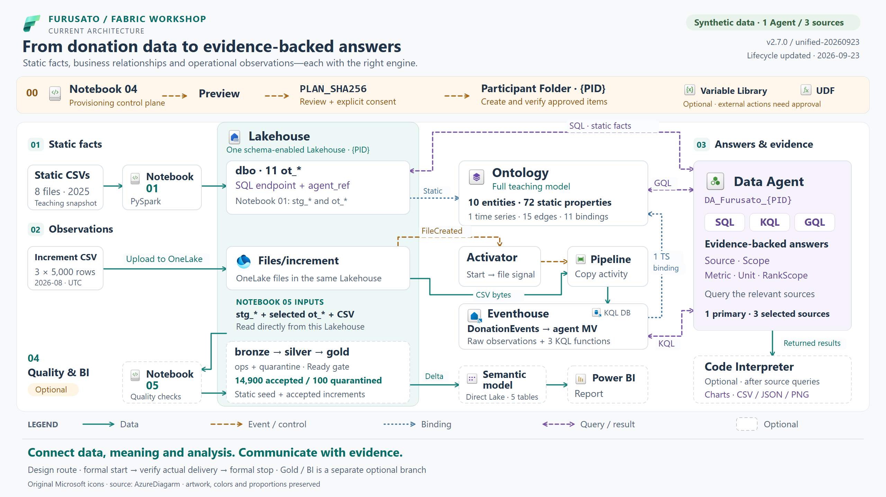

# From donation data to evidence-backed answers

[日本語](overview.ja.md) · [Explorer](index.html?lang=en&focus=overview) · [Source anchors](sources.md)

## Start with the business question

A municipality analyst wants to understand **who donated, which municipality received the donation,
which gift was selected, and which suppliers are registered for that gift**. An operations analyst
also wants to inspect newly ingested observations. A BI engineer wants comparable, quality-checked
metrics. These are related questions with different populations and evidence requirements.

The Furusato Fabric Workshop connects those perspectives through **one primary Data Agent**,
**three selected sources**, and an **optional analytics / Power BI branch**.
The point is to learn how data, business meaning and source evidence work together.

The dataset contains synthetic donor, supplier, gift and donation records. Public prefecture
and municipality references provide realistic geography. Catalog and supplier-registration
relationships describe the teaching scenario. Donation amounts describe donations; personal
wealth, income or tax liability require different evidence.



[Open full-size PNG](../assets/architecture/furusato-architecture.en.png) ·
[Scalable SVG](../assets/architecture/furusato-architecture.en.svg)

**Scope:** current `v2.7.0 / unified-20260923`. The original data paths are retained;
formal Activator lifecycle and delivery checks were updated on 2026-09-23. This is an implementation map,
rather than a proposal to deploy a new platform. [Evidence: S1–S10](sources.md).

## How to read the diagram

| Line or boundary | Meaning |
|---|---|
| Solid teal, one arrowhead | Data reading, transformation, writing or consumption |
| Dashed amber | Event signal or approved provisioning control |
| Dotted blue | Ontology data binding / modeled association |
| Dashed violet, two arrowheads | Query and result exchange |
| Dashed component border + “optional” | An extension or post-query tool |

The Lakehouse container is **one schema-enabled Lakehouse**, shown with several data surfaces.
Notebook 01 prepares teaching tables in `dbo`; Notebook 05 adds `bronze`, `silver`,
`gold`, `ops` and `quarantine` in that same Lakehouse.
Notebooks are processing items; the surfaces inside the container are their stored inputs and outputs.
The setup strip is a **control plane**, separate from the data and query paths.

## 01 — Preserve facts, then model their meaning

### Eight static CSVs → Notebook 01 → eleven `ot_*` tables

The eight seed files cover prefectures, municipalities, categories, gifts, businesses,
business–gift registrations, donors and donation orders. Notebook 01 validates the inputs,
builds typed staging tables (`stg_*`) and derives the eleven Ontology-ready `ot_*` tables.
The static population includes **80,000 Donation rows**. “Static 2025 UTC snapshot” is
the dataset's scope label; a calendar filter is a separate query choice. [S2, S3]

The Lakehouse SQL source exposes the same eleven `dbo.ot_*` tables plus:

- `agent_ref.MunicipalityStatic` — a static reference view.
- `agent_ref.MunicipalityById` — an exact municipality lookup TVF.
- `agent_ref.DonationTraceById` — an exact static donation trace TVF.

SQL owns the selected static attributes, counts, amounts and stored ranks. Retain the original
column names and declare the population, period and rank scope in the answer. [S6]

### One full teaching Ontology

The Ontology contains **10 entities, 72 static properties, one time-series property,
15 directed relationships and 11 bindings**: ten non-time-series entity bindings and
one Municipality time-series binding. Fifteen relationship contextualizations supply
the relationship mappings. [S4]

The entities are `Prefecture`, `Municipality`, `Donor`, `GiftCategory`, `Gift`, `Supplier`,
`Donation`, `MunicipalityCategoryMetric`, `PrefectureCategoryMetric` and
`PrefectureDonationFlow`.

Two paths explain the core business roles:

```text
Donor ──DonorMadeDonation──▶ Donation ──DonationToMunicipality──▶ Municipality
                                │
                         DonationSelectedGift
                                ▼
                              Gift ◀──SupplierProvidesGift── Supplier
```

Donor residence follows `DonorLivesInPrefecture`; recipient geography follows
`DonationToMunicipality` and `MunicipalityInPrefecture`. Supplier location follows
`SupplierInPrefecture`. Keeping these roles explicit makes a question such as
“Tokyo donations” answerable with the right scope.

`ot_supplier_gift` is the **registration bridge**, with 14,514 unique supplier–gift pairs.
It contributes edges, while the other ten `ot_*` tables supply the entity types.
The model allows many-to-many registration. A gift-centered question traverses
`SupplierProvidesGift` in reverse to find its registered suppliers.
This path establishes registration; fulfillment, receipt and shipping are separate business facts.
When aggregating donation amounts, preserve the donation grain: supplier fan-out requires
an explicit allocation rule. [S3, S4]

The Agent uses **native GQL** for modeled paths, directions and relationship-derived counts.
The course selects this full teaching Ontology as its graph source.

## 02 — Observe incremental ingestion at its original grain

### Three incremental CSVs → OneLake event → Activator → Pipeline Copy → Eventhouse

Each packaged increment contains **5,000 rows**. The participant uploads them one at a time
into the Lakehouse's `Files/increment` location. A **OneLake FileCreated event**
signals **Activator (Reflex)**, which starts the **Data Pipeline Copy** activity.
The event carries the file reference; **the Pipeline reads the CSV bytes from OneLake**.
The sink is `DonationEvents` in the Eventhouse's KQL Database, using
`DonationEvents_IncrementCsvMap`. [S2, S5]

This is a file-triggered ingestion design. The diagram presents **formal start →
verify actual delivery → formal stop** as a design and learning map, rather than a
live monitoring display. The participant contract also
defines the trigger's initial and final state as `Off`.
Verify each Pipeline job and its ingested rows before proceeding to the next file.
The repository records a run that needed a separately approved manual Pipeline fallback;
that operational history is distinct from the intended FileCreated route. [S5, S10]

Use official `start_rule` / portal Start for first activation; `shouldRun=true` and
Running metadata mean `armed_unverified`, not verified delivery. Automated uploads
use one complete-file PutBlob with `If-None-Match: *`. Correlate the native file event,
activation and new Completed Pipeline job, then verify Copy/KQL. Finish with
`stop_rule` / Stop. See the [operator and evidence contract](../../tools/provisioning/activation.md). [S11]

### The selected KQL surface

`DonationEvents` preserves raw observations, including repeated `EventID` values.
The approved materialized view **`DonationObservationSummaryForAgent`** summarizes by
municipality, event minute, workshop run, participant alias and source file.
Its `ObservationCount` retains the raw row count; the number of MV rows is a different metric.

The selected functions are:

- `AgentRawObservationTotals`
- `AgentFileRunSummary`
- `AgentMunicipalityLeaders`

These provide explicit operational scopes and file/run evidence. For the canonical three files,
the raw population has **15,000 rows and 14,900 distinct EventIDs**. The 100 repeats teach
producer retransmission. KQL answers keep their **raw-observation** qualification. [S2, S5, S6]

### The time-series binding

The Ontology's `Municipality.IncomingDonationAmountYen` binds directly to raw
`DonationEvents`, with `MunicipalityID` as the context key, `DonatedAt` as the time,
and `DonationAmountYen` as the value. This is the modeled operational time series;
the selected Eventhouse surface is the numeric authority for operational metrics.
The static Donation population and the raw operational population are reported separately. [S4]

## 03 — One Agent, three complementary sources

| Selected source | Query language | Evidence it contributes |
|---|---|---|
| Lakehouse tables and `agent_ref` helpers | SQL | Static attributes, exact lookups, donation counts, JPY amounts and rank scopes |
| Eventhouse approved MV and three functions | KQL | Raw observation totals, time windows, file/run provenance and leaders |
| Full teaching Ontology | Native GQL | Entity identities, relationship direction, paths and relationship-based counts |

The primary item is `DA_Furusato_{PID}`. A question uses the source or combination of
sources appropriate to its scope. The diagram's three query lines represent configured
source access, rather than a fixed requirement to run all three for every question.

**Code Interpreter is an optional post-query tool in that same Agent.**
The unified profile enables its preview capability; use depends on the question.
It can calculate, chart and export actual returned data as CSV/JSON and PNG.
SQL/KQL/GQL results remain the evidence for source facts and graph paths.
The Gold tables and Power BI semantic model belong to the separate analytics branch;
the unified Agent's selected source count remains **three**. [S1, S6]

Good answers make **Source · Scope · Metric · Unit** visible, adding **RankScope**
for rankings. Retain valid zero results and distinguish them from unavailable evidence.
Instruction-guided clarification and query checks are teaching controls whose behavior
is evaluated through actual executed queries and outputs.

## 04 — Extend into quality-gated analytics and Power BI

### Follow the actual Notebook 05 inputs

Notebook 05 reads:

1. Notebook 01's eight `stg_*` tables for the static data.
2. Selected `ot_*` dimensions for enriched prefecture, municipality, donor, category and gift attributes.
3. CSV files directly from **`Files/increment/*.csv`**.

These are **Lakehouse reads**, independently of the Eventhouse ingestion path.
The code's `LEGACY_GOLD_TABLES` constant names the selected `ot_*` inputs;
it does not refer to a preexisting `gold.*` schema. [S7]

| Schema | Role in this extension |
|---|---|
| `bronze` | Source-faithful rows with ingestion/file/batch metadata |
| `silver` | Conformed static data and accepted, deduplicated increment events |
| `quarantine` | Rejected events with explicit reasons |
| `ops` | Data-quality results, run telemetry and publication control |
| `gold` | Curated dimensions, donation facts, calendar and enriched analytics table |

The increment checks cover duplicate EventIDs, positive amounts, the approved synthetic UTC
window and known donor/municipality/gift keys. Deduplication partitions by `EventID` and orders
by `PublishedAtUtc`, `SourceFile` and input-file path. The packaged strict contract expects
**14,900 accepted rows and 100 quarantined duplicate rows**.
Publication advances through `Preparing` → `Publishing` → **`Ready`**;
consumers use one complete generation after the readiness gate. [S7]

Gold combines static donations with **accepted, deduplicated** increments and preserves
`DataSource = 'StaticSeed'` or `'RealtimeIncrement'`. This is an explicitly curated analytic
population, distinct from both the static-only `ot_donation` table and raw Eventhouse observations.
The enriched `gold.donation_agent` remains an optional evaluation artifact outside the
unified Agent's current selection.

### Direct Lake → semantic model → report

The packaged Direct Lake model reads **five Gold tables**:
`donations`, `donor`, `municipality`, `gift` and `date`.
It defines four relationships and six measures; the report has one page and nine visuals.
The model reads the Gold Delta tables through Direct Lake in OneLake.
The report's metrics preserve source and date scope, including a JST-derived donation date.
Deploying this optional branch has its own preview/apply and verification gate. [S8]

## 00 — Keep setup and runtime concerns distinct

Notebook 04 is the participant-scoped provisioning entry point:
**preview → inspect destination and plan hash → consent → apply → verify**.
It targets the participant Folder and explicitly selected `{PID}`.
For the unified course, the documented flags are `ENABLE_UNIFIED_DATA_AGENT=True` and
`ENABLE_AI_REFERENCE_ARCHITECTURE=False`. Its eight planned targets are Lakehouse,
Eventhouse, KQL Database, Notebook 01, Pipeline, Ontology, primary Data Agent and Activator.
Service-generated items and optional supporting artifacts are counted separately. [S9]

Participant ID and expected workspace name are explicit configuration.
Keep environment-specific IDs, endpoints and secrets outside source control.
When promoting an exercise between **dev / test / prod**, select the destination and settings
explicitly. The optional Variable Library template supplies Development and Test value sets;
a production choice requires its own reviewed configuration. This does not add deployment
environments or active value sets to the architecture automatically.

Notebook 02 applies semantic metadata; Notebook 03 is an alternative full-Ontology authoring path.
Variable Library and UDF are optional supporting artifacts. External UDF actions require
separate configuration and approval; the diagram represents the active data/query scope. [S9]

## What you take away

- **Model business meaning:** distinguish residence, recipient, gift selection and supplier registration.
- **Choose the right engine:** SQL for static facts, KQL for operational observations, GQL for relationships.
- **Engineer observable quality:** retain raw evidence, quarantine exceptions and publish a complete generation.
- **Deliver useful analytics:** build a Direct Lake report from a clearly defined, curated population.
- **Explain the answer:** connect every metric and chart to its source, scope, unit and query evidence.

**One workshop connects data engineering, semantic modeling and evidence-backed analysis—while
keeping the meaning of each dataset clear.**

Further reading: [single-Agent guide](../single-agent-workshop.md) ·
[implementation anchors](sources.md) · [icon provenance](icons.md).
