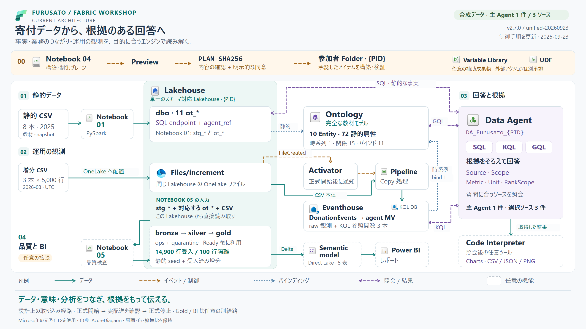

# 寄付データから、根拠のある回答へ

[English](overview.en.md) · [対話型アーキテクチャ](index.html?lang=ja&focus=overview) · [実装の根拠](sources.md)

## まず、業務の問いから

自治体の分析担当者は、**誰が寄付し、どの自治体が受け取り、どの返礼品が選ばれ、
その返礼品にどの事業者が登録されているか**を知りたいと考えます。
運用担当者は新しく取り込まれた観測データを確認し、BI エンジニアは品質を確認した
指標を比較したいと考えます。これらは関連する問いですが、対象集団と必要な根拠が異なります。

Furusato Fabric Workshop は、**主 Data Agent 1 件・選択ソース 3 件**と、
**任意の分析・Power BI 拡張**で、これらの視点をつなぎます。
学ぶ中心は、データ・業務上の意味・照会の根拠を一緒に設計することです。

寄付者・事業者・返礼品・寄付実績は合成データです。都道府県・自治体の公開情報を
地理の参照に使い、現実感のある教材にしています。カタログと事業者の関係は
教材内の登録を表します。寄付額が説明するのは寄付の事実であり、個人の資産・所得・
納税額にはそれぞれ別の根拠が必要です。



[原寸 PNG](../assets/architecture/furusato-architecture.ja.png) ·
[拡大できる SVG](../assets/architecture/furusato-architecture.ja.svg)

**対象:** 現行の `v2.7.0 / unified-20260923`。
データ経路は初版の構成を維持し、2026-09-23にActivatorの正式な開始・停止と配送確認を追記しました。
新規プラットフォームの配置提案ではなく、既存教材のつながりを示します。
[根拠: S1–S10](sources.md)。

## 図の読み方

| 線・境界 | 意味 |
|---|---|
| 青緑の実線・片矢印 | データの読み取り・変換・書き込み・利用 |
| 黄褐色の破線 | イベント通知、または承認を伴う構築制御 |
| 青の点線 | Ontology のデータバインディング・モデル上の対応 |
| 紫の破線・両矢印 | クエリと結果のやり取り |
| 破線の枠と「任意」表示 | 拡張機能または照会後のツール |

Lakehouse の枠は、複数のデータ面を持つ**単一のスキーマ対応 Lakehouse**です。
Notebook 01 は `dbo` の教材テーブルを準備し、Notebook 05 は同じ Lakehouse に
`bronze`・`silver`・`gold`・`ops`・`quarantine` を追加します。
Notebook は処理を行うアイテム、枠内のデータ面は保存された入力・出力です。
上部の構築レーンは、データ処理や照会から分けた**制御プレーン**です。

## 01 — 事実を整え、業務の意味を結び付ける

### 静的 CSV 8 本 → Notebook 01 → `ot_*` 11 テーブル

8 本の seed は、都道府県、自治体、カテゴリ、返礼品、事業者、事業者–返礼品登録、
寄付者、寄付注文を扱います。Notebook 01 が入力を検証して型付きの
`stg_*` テーブルを作り、Ontology 向けの `ot_*` 11 テーブルを導出します。
静的な Donation は **80,000 行**です。「Static 2025 UTC snapshot」は
データセットの対象範囲を示すラベルで、暦年フィルターは照会時に別途選びます。[S2, S3]

Lakehouse SQL の選択対象は、同じ 11 個の `dbo.ot_*` と、次の参照ヘルパーです。

- `agent_ref.MunicipalityStatic` — 静的データの参照 view。
- `agent_ref.MunicipalityById` — 自治体を厳密に特定する TVF。
- `agent_ref.DonationTraceById` — 静的な寄付 ID を厳密に追跡する TVF。

静的な属性・件数・金額・保存済み順位は、この SQL ソースで照会します。
列名と値を保持し、回答には対象集団・期間・順位の範囲を明示します。[S6]

### 完全な教材用 Ontology 1 件

構成は **10 Entity・72 static Property・1 time-series Property・15 有向 Relationship・
11 Binding** です。バインディングの内訳は、10 Entity の静的バインディングと、
Municipality の時系列バインディング 1 件です。15 個の contextualization が
関係のマッピングを定義します。[S4]

Entity は `Prefecture`、`Municipality`、`Donor`、`GiftCategory`、`Gift`、
`Supplier`、`Donation`、`MunicipalityCategoryMetric`、`PrefectureCategoryMetric`、
`PrefectureDonationFlow` です。

中心となる業務上の役割は、次の経路で読み取れます。

```text
Donor ──DonorMadeDonation──▶ Donation ──DonationToMunicipality──▶ Municipality
                                │
                         DonationSelectedGift
                                ▼
                              Gift ◀──SupplierProvidesGift── Supplier
```

寄付者の居住地は `DonorLivesInPrefecture`、受取側の地理は
`DonationToMunicipality` と `MunicipalityInPrefecture`、
事業者の登録所在地は `SupplierInPrefecture` でたどります。
この役割を分けると、「東京の寄付」がどの範囲を意味するかを確認できます。

`ot_supplier_gift` は **事業者と返礼品の登録を結ぶ橋渡しテーブル**で、
一意なペアを 14,514 行持ちます。これは edge の入力で、残る 10 テーブルが
Entity type に対応します。登録は多対多です。返礼品から登録事業者を調べる場合、
`SupplierProvidesGift` を逆向きにたどります。
この関係で分かるのは登録であり、配送・受領・出荷は別の業務事実です。
金額を集計するときは寄付単位を保ち、複数事業者へ展開する場合は配賦規則を明示します。[S3, S4]

Agent は **ネイティブ GQL** でモデル上の経路・方向・関係に基づく件数を照会します。
このコースのグラフソースは、上記の完全な教材モデルです。

## 02 — 増分の取り込みを、生の観測粒度で理解する

### 増分 CSV 3 本 → OneLake イベント → Activator → Pipeline Copy → Eventhouse

増分ファイルは各 **5,000 行**です。参加者が Lakehouse の `Files/increment` に
1 本ずつ置くと、**OneLake FileCreated** が **Activator（Reflex）**に通知し、
**Data Pipeline の Copy** を起動します。イベントが渡すのはファイルの参照情報で、
**CSV 本体は Pipeline が OneLake から読み取ります**。
出力先は Eventhouse の KQL Database にある `DonationEvents`、
取り込みマッピングは `DonationEvents_IncrementCsvMap` です。[S2, S5]

これはファイル到着を起点とする取り込み設計です。
図は**正式開始 → 実配送の確認 → 正式停止**という設計と学習経路を示し、
ライブ監視画面としての状態表示は行いません。
参加者契約も、開始時・終了時のトリガー状態を `Off` と定義しています。
各 Pipeline ジョブと実データ件数を確認してから、次のファイルに進みます。
既存の実施記録には、別承認の手動 Pipeline 起動へ切り替えた事例もあります。
その運用履歴と、設計上の FileCreated 経路は区別して読みます。[S5, S10]

初回は `start_rule` / ポータルのStartで正式に開始します。
`shouldRun=true` やRunning表示は `armed_unverified` であり、実配送の証明ではありません。
自動化では完成CSVをPutBlob1回・`If-None-Match: *` で新規作成し、
FileCreated・native activation・新しいCompleted Job・Copy／KQLを順に照合します。
終了時は `stop_rule` / Stopを使います。[実行コードと判定規則](../../tools/provisioning/activation.md)を参照してください。[S11]

### Agent が選択する KQL のデータ面

`DonationEvents` は、同じ `EventID` の再観測も含む生データを保持します。
承認済み materialized view **`DonationObservationSummaryForAgent`** は、
自治体・イベント分・Workshop 実行・参加者 alias・ソースファイルで集約します。
`ObservationCount` は生の行数を保持し、MV 自体の行数とは別の指標です。

選択される関数は、次の 3 本です。

- `AgentRawObservationTotals`
- `AgentFileRunSummary`
- `AgentMunicipalityLeaders`

これらで運用上の範囲と、ファイル／実行ごとの根拠を確認します。
配布された 3 本を一度ずつ取り込むと、**生データ 15,000 行・一意な EventID 14,900 件**です。
100 行の再掲は producer の再送を学ぶためのものです。
KQL の回答は、**重複を含み得る raw 観測**という意味を保ちます。[S2, S5, S6]

### 時系列バインディング

Ontology の `Municipality.IncomingDonationAmountYen` は、
生の `DonationEvents` に直接バインドします。対応は、キーが `MunicipalityID`、
時刻が `DonatedAt`、値が `DonationAmountYen` です。
このプロパティは運用時系列をモデル化したもので、運用指標の数値は
選択された Eventhouse ソースで確認します。
静的な Donation と raw の運用観測は、それぞれの対象集団として説明します。[S4]

## 03 — 1 件の Agent で、3 ソースの根拠を使い分ける

| 選択ソース | 言語 | 回答の根拠 |
|---|---|---|
| Lakehouse のテーブルと `agent_ref` ヘルパー | SQL | 静的属性、厳密な ID 照会、寄附件数、円金額、順位範囲 |
| Eventhouse の承認済み MV と 3 関数 | KQL | raw 観測、期間、ファイル／実行、自治体別の状況 |
| 完全な教材用 Ontology | ネイティブ GQL | Entity の同一性、関係の向き、経路、関係に基づく件数 |

主アイテムは `DA_Furusato_{PID}` です。質問の対象に応じて必要なソースを選び、
必要なときに組み合わせます。図の 3 本の照会線は接続構成を表し、
毎回 3 ソースを固定順序で実行する手順を意味するものではありません。

**Code Interpreter は、同じ Agent の照会後に使う任意ツール**です。
統合 profile は preview 機能を有効にし、実際の利用は質問に応じて選びます。
取得した結果に対して追加計算・作図・CSV／JSON・PNG 出力を行います。
ソースの事実と関係経路の根拠は SQL／KQL／GQL の実行結果です。
Gold と Power BI セマンティックモデルは別の分析経路に属し、
統合 Agent の選択ソース数は **3 件**です。[S1, S6]

よい回答は **Source・Scope・Metric・Unit** を示し、順位には **RankScope** を添えます。
有効な 0 件を保持し、根拠を取得できなかった場合と区別します。
指示による確認・照会ルールの動作は、実行されたクエリと出力を見て評価します。

## 04 — 品質を確認し、Power BI へつなぐ

### Notebook 05 の実際の入力をたどる

Notebook 05 は、次のデータを読みます。

1. 静的データとして Notebook 01 の 8 個の `stg_*` テーブル。
2. 都道府県・自治体・寄付者・カテゴリ・返礼品の属性として、対応する `ot_*`。
3. **`Files/increment/*.csv`** にある増分 CSV の直接読み取り。

いずれも **Lakehouse からの読み取り**で、Eventhouse の取り込みとは独立した経路です。
コードの `LEGACY_GOLD_TABLES` は入力側の `ot_*` を指す定数名で、
既存の `gold.*` スキーマを指す名前ではありません。[S7]

| スキーマ | 拡張内での役割 |
|---|---|
| `bronze` | 元データと、取り込み時刻・ファイル・バッチのメタデータ |
| `silver` | 型・キーを整えた静的データと、受入済み・重複排除済み増分 |
| `quarantine` | 理由を付けて隔離したイベント |
| `ops` | 品質検査結果、実行記録、公開制御 |
| `gold` | 整理済み dimension、寄付 fact、日付、分析用の結合済みテーブル |

検査は EventID 重複、正の金額、承認済みの合成データ UTC 期間、
既知の寄付者・自治体・返礼品キーを対象にします。
重複排除は `EventID` ごとに `PublishedAtUtc`、`SourceFile`、入力ファイルの順で決定します。
配布データの strict 契約は **14,900 行を受け入れ、100 行の重複を隔離**します。
公開状態は `Preparing` → `Publishing` → **`Ready`** と進み、
利用側は完成した 1 世代を readiness gate の後で使います。[S7]

Gold は、静的寄付と**受入済み・重複排除後**の増分を統合し、
`DataSource = 'StaticSeed'` または `'RealtimeIncrement'` を保持します。
これは分析用に定義した集団で、静的な `ot_donation` や raw の Eventhouse 観測とは
意味を分けて利用します。`gold.donation_agent` は任意の評価用成果物で、
統合 Agent の現行選択には含めません。

### Direct Lake → セマンティックモデル → レポート

配布モデルは、Gold の **5 テーブル**、`donations`・`donor`・`municipality`・
`gift`・`date` を使います。関係は 4 本、メジャーは 6 件、
レポートは 1 ページ・9 visual です。Direct Lake で OneLake の Gold Delta を読み、
元のデータ範囲と日付範囲を明示して分析します。寄付日には JST へ変換した列を使います。
この任意拡張の配置にも、独立した preview／apply と検証のゲートがあります。[S8]

## 00 — 構築と、日々のデータ処理を分ける

Notebook 04 は、参加者単位の構築入口です。
**preview → 配置先と plan hash の確認 → 同意 → apply → 検証**の順に進めます。
対象は参加者 Folder と、明示した `{PID}` です。
統合コースの設定は `ENABLE_UNIFIED_DATA_AGENT=True`、
`ENABLE_AI_REFERENCE_ARCHITECTURE=False` です。
構築対象 8 件は Lakehouse、Eventhouse、KQL Database、Notebook 01、Pipeline、
Ontology、主 Data Agent、Activator です。サービス生成アイテムと補助成果物は
別に数えます。[S9]

参加者 ID と期待する Workspace 名を明示し、環境ごとの ID・接続先・秘密情報は
ソース管理の外に保ちます。**dev / test / prod** 間へ展開するときは、
配置先と設定をその都度確認します。任意の Variable Library テンプレートには
Development と Test の value set があり、本番用は個別の確認済み設定が必要です。
図そのものが環境や active value set を作成・選択するわけではありません。

Notebook 02 はセマンティックメタデータの適用、Notebook 03 は完全な Ontology を
構成する別手順です。Variable Library と UDF は任意の補助成果物として扱います。
UDF の外部アクションには別の設定と承認が必要です。図は現行のデータ・照会範囲を示します。[S9]

## 持ち帰れること

- **業務の意味をモデル化する:** 居住地・受取先・返礼品の選択・事業者登録を分ける。
- **適したエンジンを選ぶ:** 静的な事実は SQL、運用観測は KQL、関係は GQL。
- **品質を観測可能にする:** 生データの根拠を残し、例外を隔離し、完成した世代を公開する。
- **分析につなぐ:** 明確な対象集団を持つ Gold から Direct Lake のレポートを作る。
- **回答を説明する:** 指標と図を、出典・対象・単位・照会の証拠に結び付ける。

**ひとつの Workshop で、データエンジニアリング・意味の設計・根拠のある分析がつながります。**

関連: [既存の主 Agent ガイド](../single-agent-workshop.md) ·
[実装の参照箇所](sources.md) · [アイコンの出典と利用条件](icons.md)。
